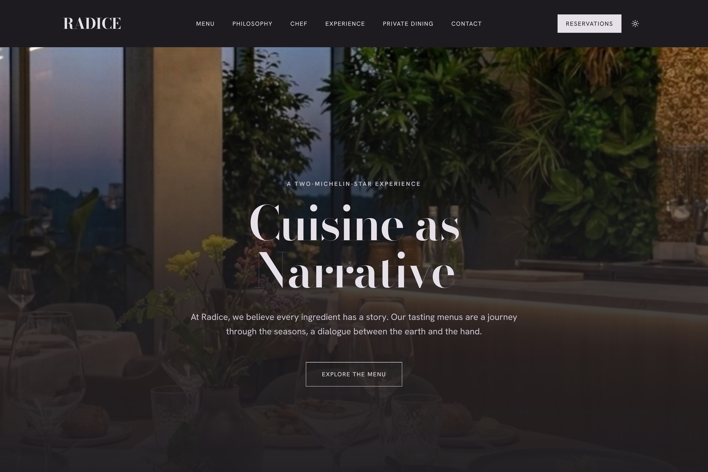

# Radice: Premium Fine Dining Starter for OlonJS

<div align="center">
  <!-- SOSTITUISCI QUESTO LINK CON L'IMMAGINE SPLIT-SCREEN (Sito vs Inspector) -->
  
</div>

**Radice** is a production-ready, editorial-grade template designed for high-end hospitality, restaurants, and premium brands. 

Powered by **[OlonJS](https://olon.it)**, it completely eliminates the friction of traditional headless CMS setups. No API keys to copy-paste, no complex data fetching to write. Just a strict, contract-first architecture that is 100% visually editable and natively ready for Agentic AI.

[](https://vercel.com/new/clone?repository-url=https://github.com/olonjs/RadiceV2&integration-ids=oac_1AZc2aypKrBOmV0Ce0BBYLRu)


## 🚀 The "Zero-Config" Vercel Experience

Clicking the **Deploy** button above triggers the OlonJS Vercel Integration. 
In less than 60 seconds, Vercel will:
1. Clone this repository to your GitHub account.
2. Authenticate you with the OlonJS Cloud.
3. Automatically provision your Sovereign Tenant and inject the required `ENV` variables.
4. Deploy a live, globally distributed edge site.

You instantly get a live website and a fully functional Visual Inspector to edit the content—**zero configuration required.**

## 🏗️ Tech Stack

* **Framework:** React 18 + Vite
* **Styling:** Tailwind CSS + CSS Variables (Strict 4-Layer Theme Chain)
* **UI Components:** [shadcn/ui](https://ui.shadcn.com/)
* **Data Contract:** Zod (Strict Schema Validation)
* **CMS Engine:** `@olonjs/core`

## 🍱 What's Included (The Capsules)

Radice comes with 11 pre-built, schema-driven sections (Capsules), ready to be mixed and matched in the OlonJS Inspector:

* `editorial-hero`: High-impact, full-screen narrative headers.
* `menu-display`: Structured tasting menus with pricing and descriptions.
* `chef-profile`: Editorial layouts for team or founder biographies.
* `philosophy-section`: Split-screen text and image blocks for storytelling.
* `gallery-grid`: Masonry-style image galleries.
* `info-grid`, `text-block`, `image-block`, `cta-banner`, `header`, `footer`.

Includes **8 pre-configured pages** (Home, Menu, Philosophy, Chef, Experience, Private Dining, Reservations, Contact) and native **Light/Dark mode** support.

## 🤖 AI-Ready by Design (Contract-First)

Unlike traditional CMSs that output a "bag of opaque HTML chunks", Radice is built on the **OlonJS Modular Type Registry Pattern (MTRP)**. 

Every piece of content is validated against a strict Zod schema (`schema.ts`). This means your website's data is deterministic, strongly typed, and perfectly structured. Whether it's the OlonJS Visual Inspector or an LLM Agent reading your site via the Model Context Protocol (MCP), the data carries its own meaning.

## 💻 Local Development

Once you have deployed the project via Vercel, you can easily pull it locally to extend the code or add new custom capsules.

```bash
# 1. Clone your newly created repository
git clone https://github.com/YOUR_USERNAME/RadiceV2.git
cd RadiceV2

# 2. Link your Vercel project to pull the OlonJS Environment Variables
npx vercel link
npx vercel env pull .env.local

# 3. Install dependencies and start the dev server
npm install
npm run dev
```

## 📖 Documentation

* [OlonJS Architecture Specifications v1.6](https://olon.it/docs/architecture)
* [Building Custom Capsules](https://olon.it/docs/capsules)
* [The 4-Layer Theme Chain](https://olon.it/docs/theming)


*Designed and engineered by the [OlonJS Team](https://olon.it).*