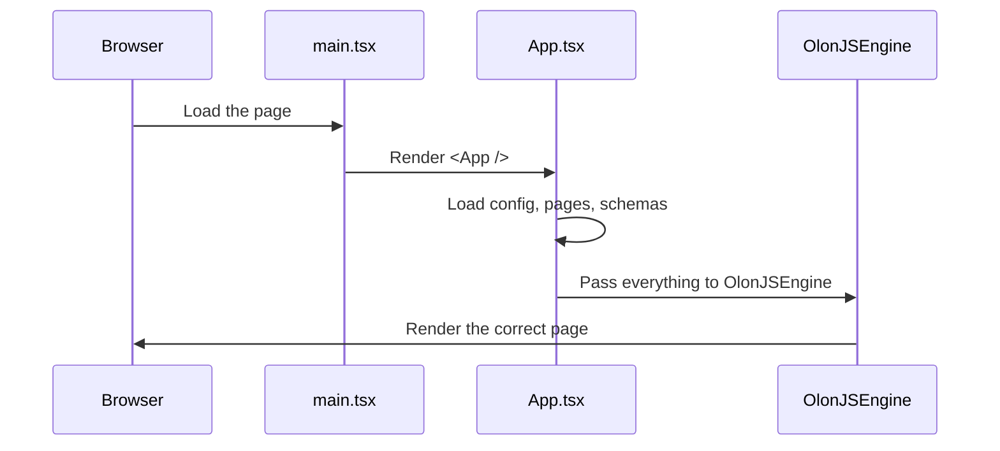
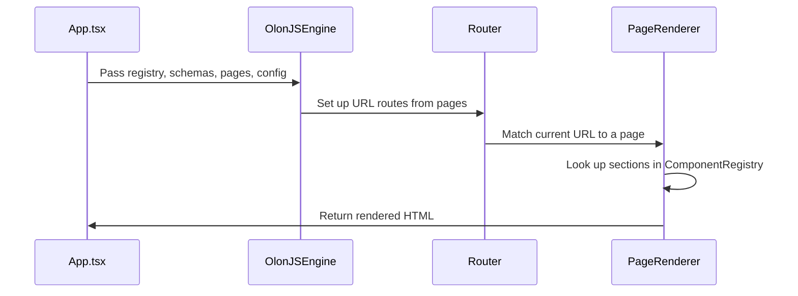

# Chapter 1: OlonJS Engine & App Entry Point

Welcome to the very first chapter of the **RadiceV2** tutorial! Whether you're brand new to web development or just new to OlonJS, you're in the right place. Let's start from the very beginning.

---

## What Problem Does This Solve?

Imagine you want to open a fine-dining restaurant. You have two choices:

1. **Build everything yourself** — design the kitchen layout, hire and train staff, create the reservation system, build the menu display, wire up the lighting, etc.
2. **Rent a fully-equipped restaurant space** — walk in, hand over your recipes and décor preferences, and start serving guests immediately.

OlonJS is option #2 for websites.

Without OlonJS, you'd need to manually wire up:
- Page routing (which URL shows which page?)
- A visual editor so non-developers can edit content
- A content management system (CMS) backend
- Preview mode for drafts
- Cloud saving

That's a *lot* of plumbing. **OlonJS handles all of that for you.** You only need to provide:
- Your **components** (what things look like)
- Your **schemas** (what data is valid)
- Your **content** (the actual text, images, etc.)

The central question this chapter answers is: **How does RadiceV2 hand all of this over to OlonJS so the site actually works?**

The answer lives in one file: `src/App.tsx`.

---

## The Maître d' Analogy

Think of `App.tsx` as the **maître d'** (the head host) of the restaurant:

- The maître d' doesn't cook the food *(that's your components)*
- The maître d' doesn't write the menu *(that's your data)*
- But the maître d' **greets guests, seats them, coordinates everything**, and makes the whole experience work smoothly

`App.tsx` boots up the OlonJS engine and says: *"Here's everything you need — now run the show."*

---

## Key Concepts

Let's break down the main ideas before looking at any code.

### 1. The OlonJS Engine (`OlonJSEngine`)

This is the core of the whole system. It's imported from `@olonjs/core/runtime` and does the heavy lifting:
- Handles routing (which page to show for which URL)
- Runs the `/admin` Visual Inspector
- Manages preview mode and cloud save

You don't build these features. You just **give the engine what it needs**.

### 2. The Things You Supply (Tenant Responsibilities)

As the "tenant" (the person using OlonJS), you supply four main things:

| What you supply | What it is |
|---|---|
| `ComponentRegistry` | A map of component names → React components |
| `SECTION_SCHEMAS` | Zod schemas describing valid data shapes |
| `siteConfig` | Site-wide settings (name, logo, etc.) |
| `themeConfig` | Colors, fonts, light/dark mode settings |

We'll explore each of these in detail in later chapters. For now, just know they exist and get passed to the engine.

### 3. The Entry Point Chain

Here's how the app starts up, from the very first file:



The browser loads `main.tsx`, which renders `<App />`, which boots the engine, which renders your site.

---

## Walking Through the Code

Let's look at the actual files, piece by piece.

### Step 1: `main.tsx` — The Starting Gun

```tsx
// src/main.tsx
import ReactDOM from 'react-dom/client';
import App from './App';

ReactDOM.createRoot(document.getElementById('root')!).render(
  <App />
);
```

This is the simplest possible file. It finds the `<div id="root">` in your HTML and renders `<App />` inside it. Think of this as flipping the power switch.

### Step 2: `App.tsx` — Importing the Engine

```tsx
// src/App.tsx (imports, simplified)
import { OlonJSEngine } from '@olonjs/core/runtime';
import { ComponentRegistry } from '@/lib/ComponentRegistry';
import { SECTION_SCHEMAS } from '@/lib/schemas';
import siteData from '@/data/config/site.json';
import themeData from '@/data/config/theme.json';
```

Here we import:
- The **engine** from the OlonJS library
- The **ComponentRegistry** (your list of components)
- The **schemas** (your data contracts)
- The **config files** (site settings and theme settings)

Nothing runs yet — we're just gathering the ingredients.

### Step 3: `App.tsx` — Preparing the Configs

```tsx
// src/App.tsx (config setup, simplified)
const siteConfig = siteData as SiteConfig;
const themeConfig = themeData as ThemeConfig;
const filePages = getFilePages(); // loads all page JSON files
```

`getFilePages()` scans your `src/data/pages/` folder and loads all the page definitions. Each page is a JSON file describing what sections appear on that page.

> 💡 **Analogy:** `getFilePages()` is like a waiter collecting all the table orders from the kitchen before service begins.

### Step 4: `App.tsx` — Handing Off to the Engine

Now the key moment — passing everything to `OlonJSEngine`:

```tsx
// src/App.tsx (engine usage, simplified)
return (
  <ThemeProvider>
    <OlonJSEngine
      componentRegistry={ComponentRegistry}
      schemas={SECTION_SCHEMAS}
      siteConfig={siteConfig}
      themeConfig={themeConfig}
      pages={filePages}
    />
  </ThemeProvider>
);
```

This is the handoff. You give the engine:
- `componentRegistry` — the map of all your components
- `schemas` — the validation rules for content
- `siteConfig` — site-wide info
- `themeConfig` — visual theme
- `pages` — the actual page content

The engine takes it from here. It figures out routing, renders the right page, and powers the admin panel.

> 💡 **Analogy:** This is the maître d' receiving the evening's reservation list, the menu, and the chef's instructions — and then running the entire dinner service.

---

## What the Engine Does With All This

Once `OlonJSEngine` receives everything, here's what happens under the hood:



1. **Engine receives** all your data
2. **Router is configured** based on your page definitions
3. **Current URL is matched** to a page
4. **Each section** on that page is looked up in the ComponentRegistry
5. **The page is rendered** and shown to the visitor

The engine also quietly sets up `/admin` for the Visual Inspector — but that's loaded lazily (only when someone actually visits `/admin`) so it doesn't slow down your regular visitors.

### A Peek Inside the Engine Boot

Here's a simplified version of what happens inside `OlonJSEngine` when it starts:

```tsx
// Simplified concept — not the actual source
function OlonJSEngine({ componentRegistry, schemas, pages, siteConfig }) {
  // 1. Validate all pages against schemas
  // 2. Set up routes
  // 3. Render the matched page
  return <Router pages={pages} registry={componentRegistry} />;
}
```

The real implementation is more complex (handling cloud saves, admin mode, preview drafts), but the core idea is simple: **receive → validate → route → render**.

---

## The Split: Tenant vs. Engine

This is the most important mental model in all of RadiceV2:

```
┌─────────────────────────────────────┐
│           YOUR CODE (Tenant)        │
│  - Components (what things look)    │
│  - Schemas (what data is valid)     │
│  - Content JSON (the actual data)   │
│  - Site & Theme config              │
└──────────────┬──────────────────────┘
               │ handed to
┌──────────────▼──────────────────────┐
│         OLONJS ENGINE               │
│  - Routing                          │
│  - Visual Inspector (/admin)        │
│  - Preview mode                     │
│  - Cloud save                       │
│  - CMS infrastructure               │
└─────────────────────────────────────┘
```

You focus on **what** your site contains. OlonJS handles **how** it all works.

---

## The `runtime.ts` Helper

There's one more file worth knowing about: `src/runtime.ts`. It's a small helper that pre-packages your configs so they can be reused in both the main app and during static site generation (SSG):

```ts
// src/runtime.ts (simplified)
export const siteConfig = siteData as SiteConfig;
export const themeConfig = themeData as ThemeConfig;
export const pages = getFilePages();
```

Think of `runtime.ts` as a **prep station** — all the ingredients are washed, chopped, and ready to go before they reach the engine.

---

## Summary

Here's what you learned in this chapter:

- `src/main.tsx` is the starting point — it renders `<App />`
- `src/App.tsx` is the **maître d'** — it gathers all your site's ingredients and hands them to the OlonJS engine
- `OlonJSEngine` (from `@olonjs/core`) handles routing, the admin panel, preview mode, and cloud saving
- **You** (the tenant) supply components, schemas, and content data
- **The engine** supplies all the CMS infrastructure

This clean split means you can focus on building a beautiful site without worrying about CMS plumbing.

---

## What's Next?

Now that you understand how the engine is booted and what it receives, it's time to look at one of the most important things you hand it: the page and site configuration files.

In the next chapter, we'll explore exactly what those JSON files look like and how they describe your entire site structure.

➡️ [Chapter 2: Page & Site Config JSON](02_page___site_config_json_.md)

---

Generated by [AI Codebase Knowledge Builder](https://github.com/The-Pocket/Tutorial-Codebase-Knowledge)