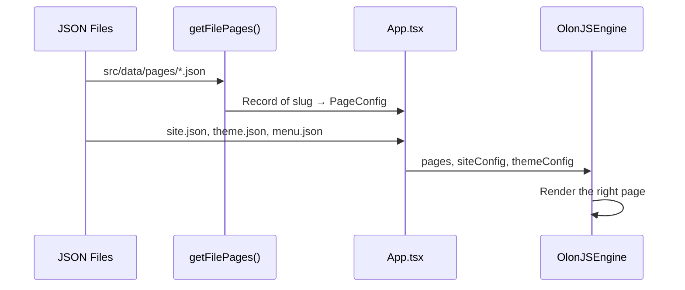

# Chapter 2: Page & Site Config JSON

In [Chapter 1: OlonJS Engine & App Entry Point](01_olonjs_engine___app_entry_point_.md), we learned how `App.tsx` acts as the maître d' — gathering all the ingredients and handing them to the OlonJS engine. One of the most important ingredients we mentioned was the **content data**. Now let's zoom in on exactly what that data looks like and where it lives.

---

## What Problem Does This Solve?

Imagine you're running a restaurant website. Your head chef wants to update the menu description. Your marketing team wants to change the homepage headline. Your manager wants to add a new "Events" page.

Without a clear, organized place to store all this content, you'd have to dig through React components to change a single line of text — and that's a job for a developer, not a chef or a marketing manager.

**The solution:** store all your actual content in simple JSON files. These files are easy to read, easy to edit, and — most importantly — the OlonJS Visual Inspector can write back to them automatically when a non-developer makes a change.

Think of these JSON files as the **restaurant's menu cards and operations manual** — they describe everything about the restaurant, and the kitchen (the engine) reads them to know what to serve.

---

## The Four Key Files

RadiceV2 organizes its content data into four types of JSON files, all living under `src/data/`:

```
src/data/
├── config/
│   ├── site.json      ← Global site identity
│   ├── theme.json     ← Design tokens (colors, fonts)
│   └── menu.json      ← Navigation links
└── pages/
    ├── home.json      ← Homepage content
    ├── about.json     ← About page content
    └── ...            ← More pages
```

Let's explore each one.

---

## 1. `site.json` — The Restaurant's Business Card

This file holds information that applies to the **entire site** — things like the restaurant's name, logo, and contact details.

```json
{
  "siteName": "Radice",
  "tagline": "Farm-to-table Italian cuisine",
  "logoUrl": "/assets/images/logo.svg",
  "contactEmail": "hello@radice.com"
}
```

> 💡 **Analogy:** `site.json` is like the business card for your restaurant. It has the name, logo, and contact info that appears everywhere — the browser tab, the footer, email signatures, etc.

When `App.tsx` imports this file, it becomes the `siteConfig` that gets passed to the engine. The engine then makes it available to every component on every page.

---

## 2. `theme.json` — The Interior Design Rulebook

This file holds **design tokens** — the colors, fonts, and spacing values that define how the site looks.

```json
{
  "colorPrimary": "#2D5016",
  "colorBackground": "#FAFAF7",
  "fontHeading": "Playfair Display",
  "fontBody": "Inter"
}
```

> 💡 **Analogy:** `theme.json` is like the interior design spec sheet for your restaurant — it says "all chairs are walnut brown, all walls are cream white." Every room (page) follows the same rules.

We'll explore themes in much more detail in [Chapter 6: ThemeProvider (Light/Dark Mode)](06_themeprovider__light_dark_mode_.md) and [Chapter 7: Local CSS Token Bridge](07_local_css_token_bridge__4_layer_theme_chain_.md).

---

## 3. `menu.json` — The Navigation Map

This file defines the links that appear in your site's navigation bar.

```json
{
  "items": [
    { "label": "Home",    "href": "/" },
    { "label": "Menu",    "href": "/menu" },
    { "label": "About",   "href": "/about" },
    { "label": "Contact", "href": "/contact" }
  ]
}
```

> 💡 **Analogy:** `menu.json` is the signage map posted at the restaurant entrance — it tells guests where everything is.

---

## 4. `pages/*.json` — The Per-Page Content

This is where the real magic happens. Each page on your site has its own JSON file, and that file contains an **array of sections**.

Here's a simplified `home.json`:

```json
{
  "sections": [
    {
      "type": "editorial-hero",
      "data": { "headline": "Welcome to Radice" }
    },
    {
      "type": "text-block",
      "data": { "body": "We source everything locally." }
    }
  ]
}
```

> 💡 **Analogy:** Each page JSON is like a **stage direction script** for that page. It says: "First, show the hero banner. Then, show a text block. Then, show the menu display." The engine reads the script and performs it.

Each entry in `sections` has:
- **`type`** — which component to use (looked up in the [ComponentRegistry](04_componentregistry_.md))
- **`data`** — the actual content to display
- **`settings`** (optional) — layout/style overrides for that section

---

## How the Files Flow Into the App

Let's trace exactly how these JSON files get loaded and used. Here's the journey:



1. `getFilePages()` scans every JSON file under `src/data/pages/` and builds a dictionary
2. `App.tsx` imports `site.json`, `theme.json`, and `menu.json` directly
3. Everything gets passed to `OlonJSEngine`
4. The engine matches the current URL to a page and renders its sections

---

## The `getFilePages()` Function

The page files are loaded automatically by a helper function. Let's look at the key idea:

```ts
// src/lib/getFilePages.ts (simplified)
export function getFilePages() {
  // Scan ALL .json files under src/data/pages/
  const glob = import.meta.glob(
    '@/data/pages/**/*.json',
    { eager: true }
  );
  // ... convert file paths to URL slugs
}
```

`import.meta.glob` is a Vite feature that finds all matching files at build time. You don't need to manually list your pages anywhere — just drop a new `.json` file in `src/data/pages/` and it's automatically registered.

The function then converts file paths into URL slugs:

```
src/data/pages/home.json    → slug: "home"    → URL: /
src/data/pages/about.json   → slug: "about"   → URL: /about
src/data/pages/menu.json    → slug: "menu"    → URL: /menu
```

> 💡 **Analogy:** `getFilePages()` is like a new waiter walking through the restaurant, picking up all the table order slips, and organizing them by table number. You don't have to tell the waiter which tables exist — they just look around and collect everything they find.

---

## What a PageConfig Looks Like in TypeScript

The TypeScript type for a page config is straightforward:

```ts
// Simplified from src/types.ts
type PageConfig = {
  sections: Array<{
    type: string;   // e.g. "editorial-hero"
    data: object;   // the content
    settings?: object; // optional layout overrides
  }>;
};
```

Each page is just a list of sections. Simple!

---

## How `App.tsx` Uses These Files

Let's look at how `App.tsx` actually loads the config files:

```tsx
// src/App.tsx (imports)
import siteData  from '@/data/config/site.json';
import themeData from '@/data/config/theme.json';
import menuData  from '@/data/config/menu.json';
import { getFilePages } from '@/lib/getFilePages';
```

Just regular imports — JSON files are imported like any other module in modern JavaScript.

Then they're prepared and passed to the engine:

```tsx
// src/App.tsx (usage)
const siteConfig  = siteData as SiteConfig;
const themeConfig = themeData as ThemeConfig;
const filePages   = getFilePages();

return (
  <OlonJSEngine
    siteConfig={siteConfig}
    themeConfig={themeConfig}
    pages={filePages}
    // ... other props
  />
);
```

The `as SiteConfig` and `as ThemeConfig` casts tell TypeScript "trust me, this JSON matches this shape." The actual validation happens via Zod schemas, which we'll cover in [Chapter 5: Zod Schema (Data Contract)](05_zod_schema__data_contract__.md).

---

## The Visual Inspector Writes Back

Here's the really clever part: these JSON files aren't just read-only. When a content author uses the OlonJS Visual Inspector (the `/admin` panel), any change they make is **written back to these same files**.

```
Content Author edits headline in /admin
         ↓
OlonJS Visual Inspector updates the value
         ↓
Writes back to src/data/pages/home.json
         ↓
Page re-renders with new content
```

> 💡 **Analogy:** It's like a restaurant manager updating the specials board — they write on the board (the JSON file), and every waiter (component) immediately sees the new specials.

This makes the JSON files the **single source of truth** for all content. There's no separate database to sync, no CMS dashboard to log into separately — the files *are* the CMS.

---

## Adding a New Page: A Practical Example

Want to add a new "Gallery" page to the site? Here's all you need to do:

**Step 1:** Create the file `src/data/pages/gallery.json`

```json
{
  "sections": [
    {
      "type": "editorial-hero",
      "data": { "headline": "Our Gallery" }
    },
    {
      "type": "gallery-grid",
      "data": { "images": [] }
    }
  ]
}
```

**Step 2:** That's it. ✅

The `getFilePages()` function will automatically pick up the new file. The engine will create a route at `/gallery`. No changes needed in `App.tsx` or any other file.

> 💡 This is the power of the file-based approach — adding content is as simple as adding a file.

---

## Summary of the Data Layer

Here's a quick reference for everything we covered:

| File | Purpose | Analogy |
|------|---------|---------|
| `config/site.json` | Global site identity | Business card |
| `config/theme.json` | Design tokens | Interior design spec |
| `config/menu.json` | Navigation links | Entrance signage |
| `pages/*.json` | Per-page section arrays | Stage direction scripts |

All of these files live under `src/data/`, are loaded at startup, and are passed to the OlonJS engine. The engine reads them to know what to render, and the Visual Inspector writes back to them when content changes.

---

## What's Next?

Now you know where the content lives and how it flows into the engine. But you might be wondering: when the engine reads `"type": "editorial-hero"` from a page JSON, how does it know *what component to actually render*?

That's the job of sections — called **Capsules** in OlonJS — which we'll explore in the next chapter.

➡️ [Chapter 3: Capsule (Section Component)](03_capsule__section_component__.md)

---

Generated by [AI Codebase Knowledge Builder](https://github.com/The-Pocket/Tutorial-Codebase-Knowledge)