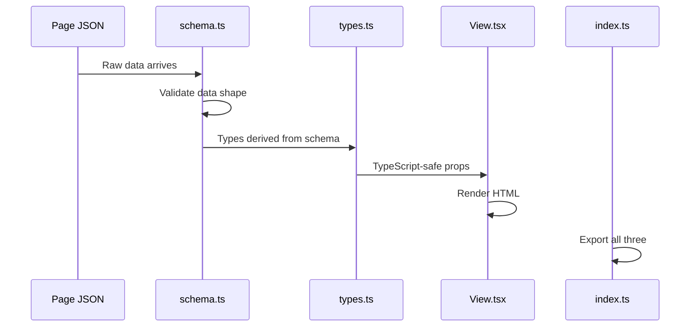
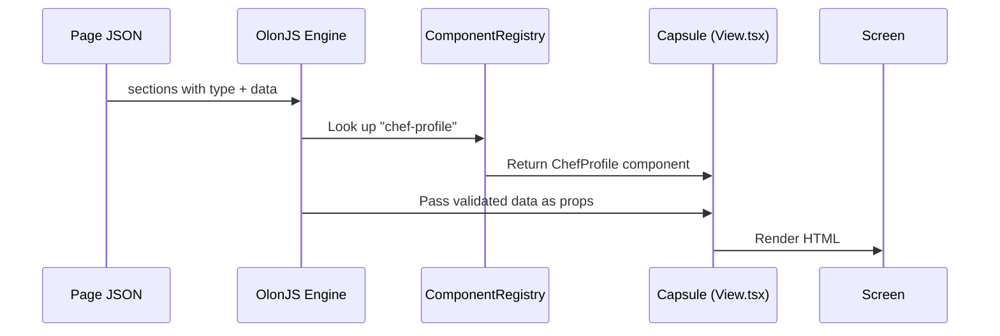

# Chapter 3: Capsule (Section Component)

In [Chapter 2: Page & Site Config JSON](02_page___site_config_json_.md), we learned how page JSON files describe a page as an ordered list of sections — each with a `type` and some `data`. But when the engine reads `"type": "chef-profile"`, how does it know what to actually *draw on screen*? That's exactly what this chapter is about.

---

## What Problem Does This Solve?

Imagine your restaurant website's homepage needs three distinct visual areas:

1. A big, beautiful **hero banner** at the top
2. A **menu display** in the middle
3. A **chef profile** section at the bottom

Each of these is visually different, has different data (a hero needs a headline; a menu needs a list of dishes), and needs to be editable by non-developers.

If you lumped all of this into one giant component, it would become impossible to maintain. And if the data and the visuals were mixed together, the Visual Inspector wouldn't know which fields to show in the editor.

**The solution:** break each page section into its own self-contained unit called a **Capsule**.

> 💡 **Analogy:** Think of Capsules like LEGO bricks. Each brick has a specific shape and purpose. You can snap them together in any order to build a page. And importantly, every brick of the same type looks and behaves the same way.

---

## What Is a Capsule?

A **Capsule** is a folder under `src/components/` that contains exactly **four files** working together:

```
src/components/chef-profile/
├── View.tsx     ← Draws the UI on screen
├── schema.ts    ← Defines what data is valid
├── types.ts     ← Exports TypeScript types
└── index.ts     ← The public "front door"
```

These four files are always kept together. Changing one almost always means updating the others too.

Let's meet each file one by one.

---

## The Four Files of a Capsule

### File 1: `View.tsx` — The Face of the Capsule

This is the React component that actually renders HTML on the page. It receives two props: `data` (the content) and `settings` (layout options).

```tsx
// src/components/chef-profile/View.tsx (simplified)
export const ChefProfile = ({ data, settings }) => {
  return (
    <section>
      
      <h2>{data.name}</h2>
      <p>{data.title}</p>
      <p>{data.bio}</p>
    </section>
  );
};
```

The component just reads from `data` and renders it. It doesn't know where the data came from — it just trusts that whatever arrives matches the expected shape.

> 💡 **Analogy:** `View.tsx` is like a chef who receives a prepared tray of ingredients and plates them beautifully. The chef doesn't go shopping — they just work with what's handed to them.

---

### File 2: `schema.ts` — The Data Contract

This file uses **Zod** to describe exactly what data the Capsule expects. Think of it as a checklist: "I need a `name` (required text), a `bio` (required text area), and optionally a `quote`."

```ts
// src/components/chef-profile/schema.ts (simplified)
import { z } from 'zod';
import { BaseSectionData } from '@olonjs/core/runtime';

export const ChefProfileSchema = BaseSectionData.extend({
  name: z.string().describe('ui:text'),
  title: z.string().describe('ui:text'),
  bio: z.string().describe('ui:textarea'),
  quote: z.string().optional().describe('ui:textarea'),
});
```

The `.describe('ui:text')` hints tell the Visual Inspector what kind of editor widget to show for each field (a single-line text box vs. a multi-line textarea).

> 💡 **Analogy:** `schema.ts` is the **order form** for this section. It says "to use this section, you must provide a name and bio. A quote is optional." If you submit an incomplete order, it gets rejected.

We'll go much deeper into schemas in [Chapter 5: Zod Schema (Data Contract)](05_zod_schema__data_contract__.md).

---

### File 3: `types.ts` — The TypeScript Types

This file derives TypeScript types *automatically* from the schema. That way, your schema and your types are always in sync — you never have to write them twice.

```ts
// src/components/chef-profile/types.ts (simplified)
import { z } from 'zod';
import { BaseSectionSettingsSchema } from '@olonjs/core/runtime';
import { ChefProfileSchema } from './schema';

export type ChefProfileData = z.infer<typeof ChefProfileSchema>;
export type ChefProfileSettings = z.infer<typeof BaseSectionSettingsSchema>;
```

`z.infer<typeof ChefProfileSchema>` is Zod's way of saying "create a TypeScript type that matches this schema." The result is that TypeScript will warn you if you try to pass the wrong data to the component.

> 💡 **Analogy:** `types.ts` is like a **mould** cast from the order form. Once the form is designed, the mould is made automatically — you don't sculpt it by hand.

---

### File 4: `index.ts` — The Public Front Door

This file re-exports everything from the other three files. It's called a "barrel export" — like a single door into the Capsule's building.

```ts
// src/components/chef-profile/index.ts
export { ChefProfile } from './View';
export { ChefProfileSchema } from './schema';
export type { ChefProfileData, ChefProfileSettings } from './types';
```

Now, anyone who needs the `ChefProfile` component just imports from `chef-profile` — they don't need to know which internal file it lives in.

> 💡 **Analogy:** `index.ts` is the **reception desk** of the Capsule's office building. Visitors don't wander the halls — they check in at reception, and reception handles the rest.

---

## How the Four Files Work Together

Here's the big picture of how all four files connect:



1. Raw data arrives from the page JSON
2. `schema.ts` validates it (wrong data is caught here)
3. `types.ts` ensures TypeScript knows the exact shape
4. `View.tsx` receives safe, typed props and renders the UI
5. `index.ts` makes all of this available to the outside world

---

## A Real Example: The `awards-accolades` Capsule

Let's walk through a complete real Capsule from RadiceV2 — one that displays a restaurant's awards.

### The Schema

```ts
// src/components/awards-accolades/schema.ts (key part)
const AwardSchema = BaseArrayItem.extend({
  title: z.string().describe('ui:text'),
  organization: z.string().describe('ui:text'),
  year: z.string().describe('ui:text'),
});

export const AwardsAccoladesSchema = BaseSectionData.extend({
  title: z.string().describe('ui:text'),
  awards: z.array(AwardSchema).describe('ui:list'),
});
```

This says: "I need a `title` string, and an array of `awards` where each award has a `title`, `organization`, and `year`."

### The View

```tsx
// src/components/awards-accolades/View.tsx (simplified)
export const AwardsAccolades = ({ data }) => {
  return (
    <section>
      <h2>{data.title}</h2>
      {data.awards.map((award, idx) => (
        <div key={idx}>
          <h3>{award.title}</h3>
          <p>{award.organization} — {award.year}</p>
        </div>
      ))}
    </section>
  );
};
```

The view simply loops through `data.awards` and renders each one. Clean and focused.

### The Page JSON That Uses It

```json
{
  "sections": [
    {
      "type": "awards-accolades",
      "data": {
        "title": "Our Recognition",
        "awards": [
          { "title": "Best New Restaurant", "organization": "Zagat", "year": "2023" }
        ]
      }
    }
  ]
}
```

When the engine sees `"type": "awards-accolades"`, it looks up the Capsule in the [ComponentRegistry](04_componentregistry_.md), validates `data` against `AwardsAccoladesSchema`, and passes the result to `AwardsAccolades` as props.

**The result:** a rendered awards section on the page. ✅

---

## Why All Four Files Must Stay in Sync

Here's a practical example of why the four files are coupled. Suppose you want to add a `category` field to each menu item in the `menu-display` Capsule.

You'd need to update **all four files**:

| File | What changes |
|------|-------------|
| `schema.ts` | Add `category: z.string().optional()` |
| `types.ts` | Automatically updated (it derives from schema) |
| `View.tsx` | Add `<span>{item.category}</span>` in the render |
| `index.ts` | Usually no change needed, but re-export if new types added |

> ⚠️ If you add the field to `View.tsx` but forget `schema.ts`, the Visual Inspector won't know about the new field and won't show an editor for it. All four files tell a consistent story.

---

## Creating Your Own Capsule (Step by Step)

Let's say you want to create a new `opening-hours` section. Here's the process:

**Step 1:** Create the folder and schema.

```ts
// src/components/opening-hours/schema.ts
import { z } from 'zod';
import { BaseSectionData } from '@olonjs/core/runtime';

export const OpeningHoursSchema = BaseSectionData.extend({
  title: z.string().describe('ui:text'),
  hours: z.string().describe('ui:textarea'),
});
```

**Step 2:** Create the types file.

```ts
// src/components/opening-hours/types.ts
import { z } from 'zod';
import { OpeningHoursSchema } from './schema';

export type OpeningHoursData = z.infer<typeof OpeningHoursSchema>;
```

**Step 3:** Create the view.

```tsx
// src/components/opening-hours/View.tsx
export const OpeningHours = ({ data }) => (
  <section>
    <h2>{data.title}</h2>
    <pre>{data.hours}</pre>
  </section>
);
```

**Step 4:** Create the barrel export.

```ts
// src/components/opening-hours/index.ts
export { OpeningHours } from './View';
export { OpeningHoursSchema } from './schema';
export type { OpeningHoursData } from './types';
```

That's your Capsule! Next, you'd register it in the [ComponentRegistry](04_componentregistry_.md) — which is exactly what the next chapter covers.

---

## The Capsule's Role in the Bigger Picture

Here's how a Capsule fits into the full system we've been building:



The page JSON says *what* to show. The ComponentRegistry says *which Capsule* to use. The Capsule's `View.tsx` says *how* to draw it.

---

## Summary

Here's what you learned in this chapter:

- A **Capsule** is a self-contained page section living in its own folder under `src/components/`
- Every Capsule ships **four files**: `View.tsx`, `schema.ts`, `types.ts`, and `index.ts`
- **`View.tsx`** renders the HTML — it's the face of the Capsule
- **`schema.ts`** defines and validates the expected data using Zod
- **`types.ts`** derives TypeScript types automatically from the schema
- **`index.ts`** is the single public export point for the whole Capsule
- Changing one file usually means updating all four — they tell a consistent story together
- Capsules are reusable: the same `chef-profile` Capsule can appear on multiple pages

The LEGO brick analogy holds perfectly: each Capsule is a self-contained, reusable building block. Snap them together in any order via your page JSON, and your page is built.

---

## What's Next?

You now know what a Capsule is and how its four files work together. But there's still a missing link: how does the OlonJS engine *find* the right Capsule when it reads `"type": "chef-profile"` from the page JSON?

That's the job of the **ComponentRegistry** — a central lookup table that maps type names to Capsule components. Let's explore it next.

➡️ [Chapter 4: ComponentRegistry](04_componentregistry_.md)

---

Generated by [AI Codebase Knowledge Builder](https://github.com/The-Pocket/Tutorial-Codebase-Knowledge)