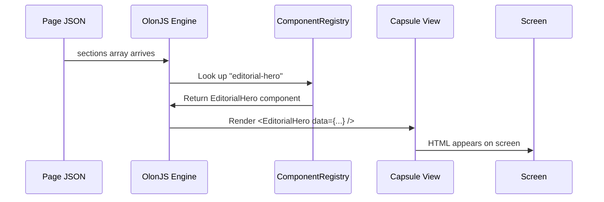
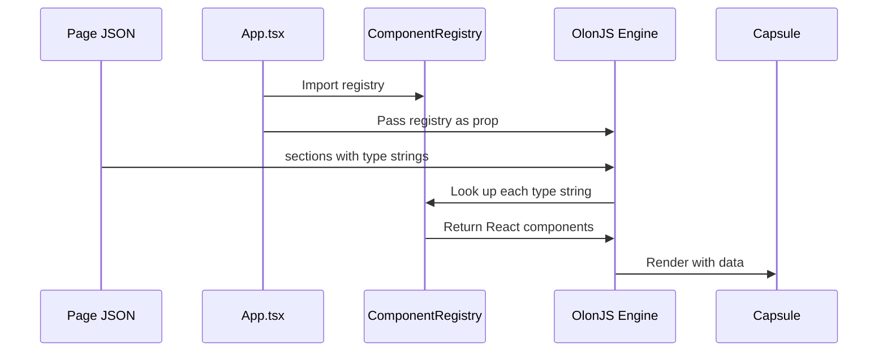

# Chapter 4: ComponentRegistry

In [Chapter 3: Capsule (Section Component)](03_capsule__section_component__.md), we learned how to build a Capsule — a self-contained page section with four files working together. By the end of that chapter, we had a brand-new `opening-hours` Capsule ready to go.

But here's the thing: **the engine still doesn't know it exists.**

When the engine reads `"type": "opening-hours"` from a page JSON, it needs somewhere to look up what that string actually means. That "somewhere" is the **ComponentRegistry**.

---

## What Problem Does This Solve?

Imagine you're the manager of a busy restaurant. A new chef joins the team and learns all the recipes. But if you never add them to the **staff roster**, the front-of-house team won't know to call on them when a table orders their dish.

The ComponentRegistry is exactly that staff roster.

Without it, you could build the most beautiful Capsule in the world — but the engine would see `"type": "opening-hours"` in a page JSON and simply shrug. *"Never heard of it."*

With the registry, the engine can say: *"Ah yes, `opening-hours`! That's the `OpeningHours` component. Let me render it."*

> 💡 **Central use case for this chapter:** You've just built the `opening-hours` Capsule from Chapter 3. You want it to actually appear on a page. How do you make the engine aware of it?

---

## The Registry Is Just a Simple Lookup Table

At its heart, the ComponentRegistry is nothing more than a JavaScript object — a **key-value map** where:

- **Key** = the string type name (e.g., `"opening-hours"`)
- **Value** = the actual React component (e.g., `OpeningHours`)

Here's the simplest possible example:

```ts
const ComponentRegistry = {
  'opening-hours': OpeningHours,
  'chef-profile':  ChefProfile,
  'editorial-hero': EditorialHero,
};
```

That's it. When the engine sees `"type": "chef-profile"` in a page JSON, it does the equivalent of `ComponentRegistry["chef-profile"]` and gets back the `ChefProfile` React component.

> 💡 **Analogy:** Think of it like a phone book. The name (`"chef-profile"`) is the listing, and the phone number (the React component) is what you actually call.

---

## Where the Registry Lives

In RadiceV2, the ComponentRegistry lives in a single file:

```
src/lib/ComponentRegistry.tsx
```

Let's look at the real file, piece by piece.

### Step 1: Import All the Capsule Components

```tsx
// src/lib/ComponentRegistry.tsx — imports
import { Header }           from '@/components/header';
import { Footer }           from '@/components/footer';
import { EditorialHero }    from '@/components/editorial-hero';
import { ChefProfile }      from '@/components/chef-profile';
import { GalleryGrid }      from '@/components/gallery-grid';
// ... and so on for every Capsule
```

Each import pulls in the `View.tsx` component from a Capsule's `index.ts` barrel export. Notice we're importing from the folder name (e.g., `@/components/chef-profile`), not from a specific file — that's the `index.ts` barrel doing its job.

### Step 2: Define the Registry Object

```tsx
// src/lib/ComponentRegistry.tsx — the registry
export const ComponentRegistry = {
  'header':         Header,
  'footer':         Footer,
  'editorial-hero': EditorialHero,
  'chef-profile':   ChefProfile,
  'gallery-grid':   GalleryGrid,
  // ... one entry per Capsule
};
```

Left side: the string that appears in page JSON files.
Right side: the React component that renders it.

They must match exactly — `"chef-profile"` in the JSON must be `'chef-profile'` in the registry.

### Step 3: The Registry Gets Passed to the Engine

Back in `App.tsx` (covered in [Chapter 1: OlonJS Engine & App Entry Point](01_olonjs_engine___app_entry_point_.md)), the registry is handed to the engine:

```tsx
// src/App.tsx — handing the registry to the engine
<OlonJSEngine
  componentRegistry={ComponentRegistry}
  // ... other props
/>
```

From this point on, the engine knows about every component in the registry.

---

## How the Engine Uses the Registry

Let's trace what happens when a visitor loads a page. Say the page JSON contains this:

```json
{
  "sections": [
    { "type": "editorial-hero", "data": { "headline": "Welcome!" } },
    { "type": "chef-profile",   "data": { "name": "Chef Maria" } }
  ]
}
```

Here's the step-by-step journey:



1. The engine reads the sections array from the page JSON
2. For each section, it takes the `type` string and looks it up in the registry
3. It gets back a React component
4. It renders that component, passing `data` and `settings` as props
5. The HTML appears on screen

If a `type` string is **not** in the registry, the engine can't find the component and the section simply won't render. This is why registration is mandatory.

---

## Adding Your New Capsule: A Step-by-Step Walkthrough

Let's complete the use case from Chapter 3. You've built the `opening-hours` Capsule. Now let's register it.

**Step 1:** Add the import at the top of `ComponentRegistry.tsx`.

```tsx
// Add this line with the other imports
import { OpeningHours } from '@/components/opening-hours';
```

**Step 2:** Add the entry to the registry object.

```tsx
export const ComponentRegistry = {
  // ... existing entries ...
  'opening-hours': OpeningHours,  // ← add this line
};
```

**Step 3:** That's it! ✅

Now you can use `"type": "opening-hours"` in any page JSON file and it will render correctly.

```json
{
  "sections": [
    {
      "type": "opening-hours",
      "data": {
        "title": "When We're Open",
        "hours": "Mon–Fri: 5pm–10pm\nSat–Sun: 12pm–10pm"
      }
    }
  ]
}
```

The engine will find `"opening-hours"` in the registry, grab the `OpeningHours` component, and render it with the provided data.

---

## The Registry and the Schemas: Two Sides of the Same Coin

The ComponentRegistry isn't the only place you need to register a new Capsule. There's a companion file: `src/lib/schemas.ts`.

```ts
// src/lib/schemas.ts — simplified
import { OpeningHoursSchema } from '@/components/opening-hours';

export const SECTION_SCHEMAS = {
  // ... existing schemas ...
  'opening-hours': OpeningHoursSchema,  // ← also add here
};
```

Think of it this way:

| File | What it registers | Purpose |
|------|-------------------|---------|
| `ComponentRegistry.tsx` | The React component | "What to render" |
| `schemas.ts` | The Zod schema | "What data is valid" |

Both files use the same string key (`'opening-hours'`). The engine needs both — the component to render the UI, and the schema to validate the data before passing it to the component.

> 💡 **Analogy:** The ComponentRegistry is the staff roster (who does the job). The schemas file is the job description (what qualifications are required). You need both.

We'll explore schemas in much more depth in [Chapter 5: Zod Schema (Data Contract)](05_zod_schema__data_contract__.md).

---

## What Happens If You Forget to Register?

Let's say you build a beautiful `wine-list` Capsule but forget to add it to the registry. You add this to a page JSON:

```json
{ "type": "wine-list", "data": { "title": "Our Cellar" } }
```

The engine looks up `"wine-list"` in the registry... and finds nothing. The section is silently skipped. No error, no placeholder — just an empty space where your wine list should be.

This is the most common "why isn't my section showing up?" mistake in RadiceV2. **Always check the registry first.**

> ⚠️ **Checklist when a section doesn't appear:**
> 1. Is the `type` string in the page JSON spelled exactly right?
> 2. Is that exact string registered in `ComponentRegistry.tsx`?
> 3. Is the schema registered in `schemas.ts`?

---

## The Full Picture: Registry in Context

Here's how the ComponentRegistry fits into everything we've learned so far:



- [Chapter 1](01_olonjs_engine___app_entry_point_.md) showed how `App.tsx` passes the registry to the engine
- [Chapter 2](02_page___site_config_json_.md) showed how page JSON files contain `type` strings
- [Chapter 3](03_capsule__section_component__.md) showed how to build a Capsule
- **This chapter** shows how the registry connects the type string to the Capsule

The registry is the bridge between the *data world* (JSON files with string names) and the *component world* (React components that render UI).

---

## A Quick Mental Model Summary

```
Page JSON says:  "type": "chef-profile"
                          ↓
ComponentRegistry says:   "chef-profile" → ChefProfile component
                          ↓
Engine renders:           <ChefProfile data={...} />
                          ↓
Screen shows:             A beautiful chef profile section ✅
```

Without the middle step — the registry lookup — the connection between name and component simply doesn't exist.

---

## Summary

Here's what you learned in this chapter:

- The **ComponentRegistry** is a simple key-value object mapping string type names to React components
- It lives in `src/lib/ComponentRegistry.tsx`
- Every Capsule **must be registered** here, or the engine won't know it exists
- You also need to register the Capsule's schema in `src/lib/schemas.ts`
- Adding a new Capsule requires just **two lines**: one import and one registry entry
- The most common debugging step when a section doesn't appear is checking the registry

The ComponentRegistry is the master lookup table — the phone book that lets the engine find the right component for every section on every page.

---

## What's Next?

Now that you understand how the engine finds the right component, let's look at what happens *just before* the component receives its data: **validation**. The Zod schema acts as a data contract, ensuring that the content in your page JSON is exactly the right shape before it ever reaches your component.

➡️ [Chapter 5: Zod Schema (Data Contract)](05_zod_schema__data_contract__.md)

---

Generated by [AI Codebase Knowledge Builder](https://github.com/The-Pocket/Tutorial-Codebase-Knowledge)