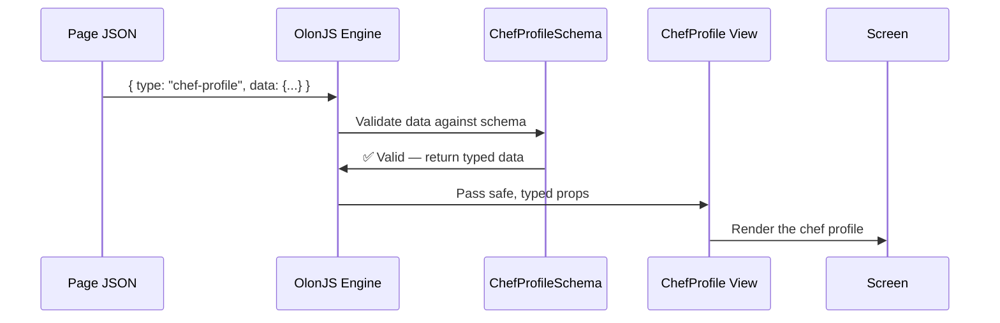

# Chapter 5: Zod Schema (Data Contract)

In [Chapter 4: ComponentRegistry](04_componentregistry_.md), we learned how the engine finds the right Capsule component when it reads a `type` string from a page JSON. But there's an important step that happens *just before* the component receives its data: **validation**. This chapter is all about that step.

---

## What Problem Does This Solve?

Imagine you're running a restaurant and you receive a delivery of ingredients. Before the chef uses them, someone at the back door checks the delivery against an **order form**: "Did we receive two kilos of pasta? Is the olive oil the right brand? Is anything missing?"

If something's wrong, it gets caught *at the door* — not halfway through cooking.

In RadiceV2, the same thing happens with content data. Before a Capsule component ever receives its props, a **Zod schema** checks the data against a strict contract:

- Is every required field present?
- Is each field the right type (text, number, list)?
- Are optional fields valid if they're included?

If the data doesn't pass, it's caught immediately — not buried deep in a rendering error.

> 💡 **The central use case for this chapter:** You're building a `chef-profile` section. You want to guarantee that whoever edits the content (a developer *or* a non-technical content author in the Visual Inspector) always provides a `name` and `bio`, and that the Visual Inspector shows the right editor widgets for each field. How do you declare that contract?

The answer is a **Zod schema**.

---

## What Is Zod?

[Zod](https://zod.dev) is a JavaScript library for describing and validating data shapes. Think of it as a way to write down the rules for what valid data looks like.

Here's the simplest possible example:

```ts
import { z } from 'zod';

const NameSchema = z.object({
  name: z.string(),
  age: z.number(),
});
```

This says: "valid data must be an object with a `name` that's a string and an `age` that's a number." If you try to validate `{ name: "Maria", age: "thirty" }`, Zod will reject it — `age` must be a number, not a string.

That's the core idea. Now let's see how RadiceV2 uses it.

---

## The Schema as a Customs Form

Every Capsule has a `schema.ts` file (we first saw this in [Chapter 3: Capsule (Section Component)](03_capsule__section_component__.md)). This file is the **customs form** for that Capsule's data.

Let's look at the `chef-profile` schema:

```ts
// src/components/chef-profile/schema.ts
import { z } from 'zod';
import { BaseSectionData, ImageSelectionSchema } from '@olonjs/core/runtime';

export const ChefProfileSchema = BaseSectionData.extend({
  name:  z.string().describe('ui:text'),
  title: z.string().describe('ui:text'),
  bio:   z.string().describe('ui:textarea'),
  quote: z.string().optional().describe('ui:textarea'),
  image: ImageSelectionSchema.optional(),
});
```

Let's unpack each piece one by one.

---

## Key Concept 1: `BaseSectionData` — The Foundation

Every Capsule schema starts from `BaseSectionData`, which is provided by OlonJS:

```ts
import { BaseSectionData } from '@olonjs/core/runtime';

export const ChefProfileSchema = BaseSectionData.extend({ /* ... */ });
```

`BaseSectionData` already includes the common fields that *every* section needs — things like an internal ID. By calling `.extend({...})`, you're saying "take all the base fields, and add these new ones on top."

> 💡 **Analogy:** `BaseSectionData` is like a pre-printed form that already has the standard header fields filled in (date, form number). You just add the fields specific to your section.

---

## Key Concept 2: Field Types — Describing the Data

Inside `.extend({...})`, you declare each field using Zod's type builders:

```ts
name:  z.string(),          // must be text
age:   z.number(),          // must be a number
active: z.boolean(),        // must be true or false
items: z.array(z.string()), // must be a list of strings
```

For the `chef-profile`, all the main fields are strings:

```ts
name:  z.string(),  // e.g. "Chef Maria Rossi"
title: z.string(),  // e.g. "Executive Chef"
bio:   z.string(),  // e.g. "Maria has cooked for 20 years..."
```

If the page JSON contains `{ "name": 42 }`, Zod will catch it: `name` must be a string, not a number.

---

## Key Concept 3: `.optional()` — Not Required

Some fields are nice to have but not mandatory. Mark them with `.optional()`:

```ts
quote: z.string().optional(),
image: ImageSelectionSchema.optional(),
```

This means: "if `quote` is present, it must be a string. But it's fine if it's missing entirely."

> 💡 **Analogy:** On your customs form, "passport number" is required. "Middle name" is optional — leave it blank and you still get through.

---

## Key Concept 4: `.describe('ui:...')` — The Visual Inspector Hint

This is the most *magical* part of the schema. Each field can carry a hint using `.describe()`:

```ts
name:  z.string().describe('ui:text'),
bio:   z.string().describe('ui:textarea'),
image: ImageSelectionSchema.optional().describe('ui:image'),
```

These hints tell the **OlonJS Visual Inspector** which editor widget to show when a content author edits this field:

| Hint | Editor Widget |
|------|--------------|
| `ui:text` | Single-line text input |
| `ui:textarea` | Multi-line text area |
| `ui:image` | Image picker |
| `ui:list` | Repeatable list editor |
| `ui:cta` | Call-to-action link editor |

> 💡 **Analogy:** The `.describe('ui:...')` hint is like writing a note on the customs form: "This field should be filled in using a *dropdown*" or "This field needs a *date picker*." The inspector reads the note and shows the right tool.

Without these hints, the Visual Inspector wouldn't know whether a field should be a one-line box or a big text area. The schema is the **single source of truth** for both validation *and* the editor UI.

---

## Key Concept 5: `z.array()` and Nested Schemas — Lists of Items

Some sections have repeatable items — a list of awards, a menu with multiple dishes, a gallery with many images. For these, you use `z.array()` with a nested schema:

```ts
// From awards-accolades/schema.ts
const AwardSchema = BaseArrayItem.extend({
  title:        z.string().describe('ui:text'),
  organization: z.string().describe('ui:text'),
  year:         z.string().describe('ui:text'),
});

export const AwardsAccoladesSchema = BaseSectionData.extend({
  title:  z.string().describe('ui:text'),
  awards: z.array(AwardSchema).describe('ui:list'),
});
```

`AwardSchema` describes one award. `z.array(AwardSchema)` says "I need a list of awards, and each one must match `AwardSchema`."

The `.describe('ui:list')` hint tells the Visual Inspector to show a **repeatable list editor** for this field — so content authors can add, remove, and reorder awards visually.

> 💡 **Analogy:** `z.array(AwardSchema)` is like a section of the customs form that says "list all items you're bringing in" — and each row of the list must follow its own mini-form.

---

## The Schema in Action: Step by Step

Here's what happens when a visitor loads a page that contains a `chef-profile` section:



1. The page JSON arrives with raw data
2. The engine looks up `ChefProfileSchema` from `src/lib/schemas.ts`
3. The schema validates the data — if anything is wrong, it's caught here
4. If valid, the typed data is passed to the `ChefProfile` component
5. The component renders on screen

If step 3 fails (e.g., `name` is missing), the section won't render and the error is reported clearly.

---

## How the Schema Connects to Everything Else

The schema is registered in `src/lib/schemas.ts` alongside all the other Capsule schemas:

```ts
// src/lib/schemas.ts (simplified)
import { ChefProfileSchema } from '@/components/chef-profile';

export const SECTION_SCHEMAS = {
  'chef-profile': ChefProfileSchema,
  // ... other schemas
};
```

This is the companion file to the [ComponentRegistry](04_componentregistry_.md) — both use the same string key (`'chef-profile'`). The engine uses the registry to find the component and the schemas to validate the data.

---

## The Schema Is the Single Source of Truth

Here's the most important idea in this chapter: the schema serves **two masters** simultaneously.

```
                    ChefProfileSchema
                          │
          ┌───────────────┴───────────────┐
          ▼                               ▼
  TypeScript Types                Visual Inspector
  (developer safety)              (editor widgets)
  
  name: string                    ui:text → text input
  bio: string                     ui:textarea → big box
  image?: ImageSelection          ui:image → image picker
```

**For developers:** TypeScript uses the schema (via `z.infer`) to give you autocomplete and type errors if you try to use a field that doesn't exist.

**For content authors:** The Visual Inspector reads the `.describe('ui:...')` hints and renders the right editor widget for each field.

You write the schema once. Both worlds benefit automatically.

---

## A Complete Schema Walkthrough: `menu-display`

Let's read through a complete, real schema from RadiceV2:

```ts
// src/components/menu-display/schema.ts
import { z } from 'zod';
import { BaseSectionData, BaseArrayItem } from '@olonjs/core/runtime';
```

First, we import Zod and the base types from OlonJS.

```ts
const MenuItemSchema = BaseArrayItem.extend({
  name:        z.string().describe('ui:text'),
  description: z.string().optional().describe('ui:textarea'),
  price:       z.string().optional().describe('ui:text'),
});
```

Then we define what one menu item looks like: a required `name`, and optional `description` and `price`.

```ts
export const MenuDisplaySchema = BaseSectionData.extend({
  title:       z.string().describe('ui:text'),
  description: z.string().optional().describe('ui:textarea'),
  items:       z.array(MenuItemSchema).describe('ui:list'),
  footnote:    z.string().optional().describe('ui:text'),
});
```

Finally, the full section schema: a `title`, optional `description`, a list of `items` (each following `MenuItemSchema`), and an optional `footnote`.

**What this produces in the Visual Inspector:**
- A text input for `title`
- A textarea for `description`
- A repeatable list editor for `items`, where each item has its own text/textarea fields
- A text input for `footnote`

All from one schema file. ✅

---

## Types Are Derived Automatically

Once the schema is written, you get TypeScript types for free in `types.ts`:

```ts
// src/components/chef-profile/types.ts
import { z } from 'zod';
import { ChefProfileSchema } from './schema';

export type ChefProfileData = z.infer<typeof ChefProfileSchema>;
```

`z.infer<typeof ChefProfileSchema>` reads the schema and produces a TypeScript type that exactly matches it. If you later add a field to the schema, the type updates automatically — no manual maintenance needed.

> 💡 **Analogy:** It's like having a photocopier that always makes a perfect copy of your latest customs form. You update the original, and the copy is updated instantly.

---

## Summary

Here's what you learned in this chapter:

- A **Zod schema** is a strict contract that describes the exact shape of data a Capsule expects
- Every Capsule has a `schema.ts` file that exports its schema
- Schemas start from `BaseSectionData.extend({...})` and add fields specific to that Capsule
- **`z.string()`, `z.number()`, `z.array()`** etc. describe the type of each field
- **`.optional()`** marks fields that don't have to be present
- **`.describe('ui:...')`** hints tell the Visual Inspector which editor widget to show
- The schema is the **single source of truth** — it drives both TypeScript type safety and the Visual Inspector's editor UI
- TypeScript types are derived automatically from the schema using `z.infer`

The schema is the customs officer at the door: nothing gets through unless it fills out the form correctly. And the form itself tells the Visual Inspector exactly how to build the editing UI for content authors.

---

## What's Next?

Now that you understand how data is validated and how the editor UI is driven by schemas, let's look at the visual layer of RadiceV2 — specifically how the site handles light and dark mode, and how your theme configuration powers the entire visual experience.

➡️ [Chapter 6: ThemeProvider (Light/Dark Mode)](06_themeprovider__light_dark_mode__.md)

---

Generated by [AI Codebase Knowledge Builder](https://github.com/The-Pocket/Tutorial-Codebase-Knowledge)