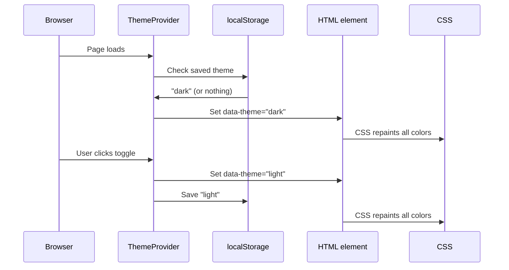

# Chapter 6: ThemeProvider (Light/Dark Mode)

In [Chapter 5: Zod Schema (Data Contract)](05_zod_schema__data_contract__.md), we learned how schemas act as customs officers — checking that data is the right shape before it ever reaches a component. Now let's shift from data validation to something more visual: **how the entire site switches between light and dark mode**.

---

## What Problem Does This Solve?

Imagine you're sitting in a restaurant at night. The staff dims the lights, switches on candles, and suddenly the whole atmosphere changes — same tables, same chairs, same menu, but everything *looks* different.

That's exactly what light/dark mode does for a website. Same content, same components, but the colors flip to suit the time of day (or the visitor's personal preference).

Without a centralized system, you'd have to manually track "is it dark mode?" in *every* component. Change the hero banner? Check. Change the footer? Check. Change the navigation? Check. That's exhausting and error-prone.

**The solution:** a single `ThemeProvider` that acts like a master light switch wired to the whole building. Flip it once, and every room changes simultaneously.

> 💡 **Central use case:** A visitor arrives at the RadiceV2 site for the first time. Their laptop is set to dark mode. The site should automatically start in dark mode, remember that preference for their next visit, and let them toggle to light mode with a button click — all without any individual component needing to worry about it.

---

## The Big Picture First

Before diving into code, here's the mental model:

```
ThemeProvider (the master switch)
       │
       ▼
Sets data-theme="dark" on <html>
       │
       ▼
CSS sees data-theme and swaps all colors
       │
       ▼
Every component on every page updates instantly ✅
```

The trick is that `ThemeProvider` doesn't reach into each component and change its colors. Instead, it just flips one attribute on the `<html>` element — and CSS takes care of the rest automatically.

---

## Key Concept 1: The `data-theme` Attribute

The `<html>` element at the top of every webpage is the ancestor of everything. If you set an attribute on it, every element inside can "see" that attribute through CSS.

```html
<!-- Dark mode -->
<html data-theme="dark">
  <!-- every element inside is now in dark mode -->
</html>

<!-- Light mode -->
<html data-theme="light">
  <!-- every element inside is now in light mode -->
</html>
```

Your CSS can then say: "when the `html` element has `data-theme="dark"`, use these colors; otherwise, use those colors." We'll explore that CSS layer deeply in [Chapter 7: Local CSS Token Bridge (4-Layer Theme Chain)](07_local_css_token_bridge__4_layer_theme_chain__.md). For now, just know that **one attribute change = the whole site repaints**.

> 💡 **Analogy:** `data-theme` is like the main circuit breaker in a building. Flip it, and every light in every room switches at once.

---

## Key Concept 2: React Context — Sharing State Everywhere

`ThemeProvider` uses a React feature called **Context**. Context lets you share a piece of data (like "are we in dark mode?") with *any* component in the tree — without having to pass it as a prop through every layer.

Think of it like a building-wide intercom system. Anyone can tune in to hear the current announcement ("we're in dark mode!") without needing a direct wire from the source.

Here's the context definition:

```ts
// src/components/ThemeProvider.tsx
type Theme = 'dark' | 'light'

interface ThemeContextValue {
  theme: Theme        // current theme
  toggleTheme: () => void  // flip between dark/light
  setTheme: (t: Theme) => void  // set a specific theme
}
```

Any component that calls `useTheme()` gets access to all three of these.

---

## Key Concept 3: Remembering the Preference

The `ThemeProvider` needs to figure out the right starting theme. It checks three places, in order:

```
1. Is data-theme already set on <html>?  → use that
2. Is there a saved value in localStorage? → use that
3. What does the OS prefer?              → use that
```

Here's the function that does this:

```ts
// src/components/ThemeProvider.tsx
function resolveInitialTheme(): Theme {
  // Check if theme is already on the HTML element
  const fromDom = document.documentElement.getAttribute('data-theme')
  if (isTheme(fromDom)) return fromDom

  // Check localStorage for a saved preference
  const fromStorage = window.localStorage.getItem('olon:theme')
  if (isTheme(fromStorage)) return fromStorage

  // Fall back to the OS preference
  const prefersLight = window.matchMedia('(prefers-color-scheme: light)').matches
  return prefersLight ? 'light' : 'dark'
}
```

This runs once when the page first loads. A first-time visitor on a dark-mode laptop will automatically get dark mode. A returning visitor who previously chose light mode will get light mode (from `localStorage`).

> 💡 **Analogy:** It's like a smart thermostat. It first checks if someone already set the temperature manually, then checks its memory of your last preference, and finally falls back to the recommended default.

---

## Key Concept 4: Keeping Things in Sync

Once the theme is chosen, `ThemeProvider` needs to keep the `data-theme` attribute and `localStorage` in sync whenever the theme changes.

```ts
// src/components/ThemeProvider.tsx
useEffect(() => {
  // Update the HTML element
  document.documentElement.setAttribute('data-theme', theme)
  // Save to localStorage for next visit
  window.localStorage.setItem('olon:theme', theme)
}, [theme])
```

`useEffect` runs every time `theme` changes. So whenever someone clicks the toggle button, this effect fires, updates the HTML attribute, and saves the new preference — all in one step.

---

## The Full Provider Component

Now let's see the whole `ThemeProvider` component assembled:

```tsx
// src/components/ThemeProvider.tsx (simplified)
export function ThemeProvider({ children }: { children: ReactNode }) {
  const [theme, setThemeState] = useState<Theme>(resolveInitialTheme)

  useEffect(() => {
    document.documentElement.setAttribute('data-theme', theme)
    window.localStorage.setItem('olon:theme', theme)
  }, [theme])

  function toggleTheme() {
    setThemeState((prev) => (prev === 'dark' ? 'light' : 'dark'))
  }

  const value = useMemo(() => ({ theme, toggleTheme, setTheme: setThemeState }), [theme])

  return <ThemeContext.Provider value={value}>{children}</ThemeContext.Provider>
}
```

`ThemeProvider` wraps its `children` in `ThemeContext.Provider`, making the theme available to everything inside it.

The `useMemo` on the last line is a small performance optimization — it avoids recreating the context value object on every render unless `theme` actually changes.

---

## How to Use the Theme in Any Component

Any component can read and change the theme using the `useTheme()` hook:

```tsx
import { useTheme } from '@/components/ThemeProvider'

function MyToggleButton() {
  const { theme, toggleTheme } = useTheme()

  return (
    <button onClick={toggleTheme}>
      {theme === 'dark' ? '☀️ Light mode' : '🌙 Dark mode'}
    </button>
  )
}
```

**What happens when the button is clicked:**
1. `toggleTheme()` is called
2. `ThemeProvider` updates its state from `'dark'` to `'light'` (or vice versa)
3. The `useEffect` fires, setting `data-theme="light"` on `<html>`
4. CSS sees the new attribute and repaints all colors
5. The button text updates to show the new state

All of that from one function call. ✅

---

## Where ThemeProvider Lives in the App

`ThemeProvider` wraps the entire application in `App.tsx`, so it's available everywhere:

```tsx
// src/App.tsx (simplified)
return (
  <ThemeProvider>
    <OlonJSEngine
      componentRegistry={ComponentRegistry}
      // ... other props
    />
  </ThemeProvider>
)
```

Because `ThemeProvider` is the *outermost* wrapper, every single component inside the engine — every Capsule, every page, every header and footer — can access the theme.

> 💡 **Analogy:** `ThemeProvider` is like the main electrical panel in a building. It's installed first, before any rooms are built, so every room gets power automatically.

---

## The Header's Local Toggle

There's one interesting wrinkle: the `Header` component has its own *local* copy of the theme toggle, independent of the global `ThemeProvider`.

```tsx
// src/components/header/View.tsx (simplified)
const [theme, setTheme] = React.useState<'light' | 'dark'>('light')

const toggleTheme = () => {
  const nextTheme = theme === 'dark' ? 'light' : 'dark'
  document.documentElement.setAttribute('data-theme', nextTheme)
  setTheme(nextTheme)
}
```

Instead of calling `useTheme()` from the context, the Header manages its own `theme` state and directly writes to `document.documentElement`. Both approaches achieve the same result — updating `data-theme` on `<html>` — but the Header does it locally.

> 💡 **Analogy:** This is like a light switch in a specific room that *also* controls the master circuit. Either switch works; they both flip the same breaker.

This means the navigation bar's toggle button works correctly even if the global `ThemeProvider` context isn't directly consumed by the Header.

---

## How It All Works: Step by Step

Here's the full journey from a visitor's first page load to a theme toggle:



1. Page loads → `ThemeProvider` runs `resolveInitialTheme()`
2. Checks `localStorage` for a saved preference
3. Sets `data-theme` on `<html>`
4. CSS responds and paints the correct colors
5. User clicks the toggle → `toggleTheme()` fires
6. `data-theme` is updated and `localStorage` is saved
7. CSS repaints everything with the new colors

---

## Exporting `useTheme`

The `useTheme` hook is exported from the same file:

```ts
// src/components/ThemeProvider.tsx
export function useTheme() {
  return useContext(ThemeContext)
}
```

This is a simple wrapper around React's `useContext`. Import `useTheme` in any component and you immediately have access to `theme`, `toggleTheme`, and `setTheme`.

---

## Quick Reference

| What you want | How to do it |
|---|---|
| Read the current theme | `const { theme } = useTheme()` |
| Toggle between dark/light | `const { toggleTheme } = useTheme()` |
| Force a specific theme | `const { setTheme } = useTheme(); setTheme('light')` |
| Wrap the whole app | `<ThemeProvider>...</ThemeProvider>` in `App.tsx` |

---

## Summary

Here's what you learned in this chapter:

- `ThemeProvider` is a **React context** that manages the site-wide light/dark theme
- It works by setting a `data-theme` attribute on the `<html>` element — CSS does the rest
- On first visit, it respects the **OS preference** (`prefers-color-scheme`)
- It **persists** the user's choice to `localStorage` so it's remembered on return visits
- Any component can read and change the theme using the `useTheme()` hook
- `ThemeProvider` wraps the entire app in `App.tsx`, making it available everywhere
- The `Header` component has its own local toggle that also writes to `data-theme` directly

The `ThemeProvider` is the master light switch of RadiceV2 — one flip, and the whole building changes.

---

## What's Next?

Now you know *how* the theme is switched. But you might be wondering: *how does changing `data-theme` actually change the colors of every component?* That's the job of the CSS token system — a clever four-layer chain that connects your theme choice all the way down to individual pixel colors.

➡️ [Chapter 7: Local CSS Token Bridge (4-Layer Theme Chain)](07_local_css_token_bridge__4_layer_theme_chain__.md)

---

Generated by [AI Codebase Knowledge Builder](https://github.com/The-Pocket/Tutorial-Codebase-Knowledge)