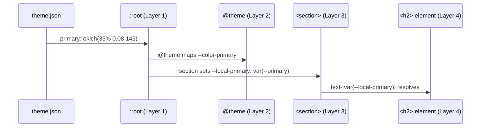

# Chapter 7: Local CSS Token Bridge (4-Layer Theme Chain)

In [Chapter 6: ThemeProvider (Light/Dark Mode)](06_themeprovider__light_dark_mode_.md), we learned how flipping `data-theme` on the `<html>` element switches the whole site between light and dark mode. But you might be wondering: *how does changing one attribute on `<html>` actually change the color of a button deep inside a section component?*

That's exactly what this chapter answers.

---

## What Problem Does This Solve?

Imagine a large hotel chain. The brand office in headquarters decides the official color palette — "forest green for primary, cream for backgrounds." That decision needs to travel from headquarters all the way down to every individual hotel room without each room manager having to call headquarters directly.

In RadiceV2, the same challenge exists with colors and design values. You have:

- **One global brand palette** (defined once, used everywhere)
- **Many individual sections** (each needing only *some* of those colors)

Without a system, you'd either repeat the same color values in dozens of places (hard to update) or pass colors as props through layers of components (messy and fragile).

**The solution:** a four-layer chain that passes brand colors *downward*, step by step, until each section holds only the handful of variables it actually needs.

> 💡 **Central use case:** You want to change the site's primary brand color from forest green to deep burgundy. You change it in *one place*, and every section on every page — hero banners, award cards, reservation CTAs — all update automatically. How does that work?

---

## The Relay Race Mental Model

Before any code, here's the big picture. Think of it like a **relay race**:

```
🏃 Runner 1 (Engine)      → injects global tokens onto :root
🏃 Runner 2 (Tailwind)    → @theme picks up those tokens
🏃 Runner 3 (Capsule)     → section maps tokens to --local-* variables
🏃 Runner 4 (Utilities)   → Tailwind classes reference --local-* variables
```

The baton (your brand color) is passed from runner to runner. By the time it reaches the finish line (the actual pixel on screen), it has traveled through four clean handoffs.

Let's meet each runner.

---

## Layer 1: The Engine Injects Global Tokens onto `:root`

The first layer is handled automatically by the OlonJS engine. When the app starts, the engine reads your `theme.json` (which we saw in [Chapter 2: Page & Site Config JSON](02_page___site_config_json_.md)) and writes CSS custom properties onto the `:root` element.

`:root` is a special CSS selector that matches the very top of the page — it's like the lobby of a building. Variables defined here are visible to every room inside.

```css
/* What the engine writes onto :root (simplified) */
:root {
  --primary: oklch(35% 0.08 145);
  --background: oklch(98% 0.01 90);
  --foreground: oklch(15% 0.02 90);
  --accent: oklch(55% 0.12 145);
  --border: oklch(88% 0.02 90);
}
```

These are your **global design tokens** — the brand's official color values. They exist on `:root` and are available everywhere on the page.

> 💡 **Analogy:** Layer 1 is the headquarters memo. "Our primary color is forest green. Here it is, in writing, posted on the main noticeboard."

---

## Layer 2: Tailwind's `@theme` Picks Them Up

The second layer is inside your `tailwind.config` or a global CSS file. Tailwind's `@theme` block reads the `:root` variables and makes them available as Tailwind utility classes.

```css
/* In your global CSS */
@theme {
  --color-primary: var(--primary);
  --color-background: var(--background);
  --color-foreground: var(--foreground);
}
```

After this, you can write Tailwind classes like `bg-primary` or `text-foreground` and they'll resolve to whatever `--primary` and `--foreground` are currently set to on `:root`.

> 💡 **Analogy:** Layer 2 is the regional manager translating the headquarters memo into the local language. "HQ says 'primary color'. In our system, that means use the `bg-primary` utility class."

This layer is mostly invisible — it happens in config files and you rarely touch it. But it's the bridge that lets Tailwind "know about" your brand tokens.

---

## Layer 3: Each Capsule Re-Maps Tokens to `--local-*` Variables

This is the most important layer to understand as a developer. Each Capsule's `View.tsx` sets a small set of `--local-*` CSS variables directly on its own `<section>` element.

Let's look at the `awards-accolades` Capsule:

```tsx
// src/components/awards-accolades/View.tsx
<section
  style={{
    '--local-bg': 'var(--elevated)',
    '--local-text': 'var(--foreground)',
    '--local-primary': 'var(--primary)',
    '--local-border': 'var(--border)',
  } as React.CSSProperties}
  className="bg-[var(--local-bg)] py-32"
>
```

The section says: "For *my* background, use whatever `--elevated` is. For *my* primary color, use whatever `--primary` is."

Now compare the `reservation-cta` Capsule — a section with an inverted, dark background:

```tsx
// src/components/reservation-cta/View.tsx
<section
  style={{
    '--local-bg': 'var(--primary)',
    '--local-text': 'var(--primary-foreground)',
    '--local-primary': 'var(--primary-foreground)',
  } as React.CSSProperties}
  className="bg-[var(--local-bg)] py-32"
>
```

Notice: this section *flips* the mapping. Its `--local-bg` points to `--primary` (making it a colored background), and its `--local-text` points to `--primary-foreground` (making text light on that dark background).

> 💡 **Analogy:** Layer 3 is each hotel room manager saying "for *this* room, the wall color comes from the brand palette's primary, but the ceiling comes from the neutral palette." Each room has its own local decisions, but always drawing from the same central palette.

This is the **bridge** — it translates global tokens into local context.

---

## Layer 4: Tailwind Utilities Reference `--local-*`

The final layer is the simplest. Inside each Capsule, every element uses Tailwind's arbitrary value syntax to reference the local variables:

```tsx
// Inside a Capsule — referencing local variables
<h2 className="text-[var(--local-text)]">
  {data.title}
</h2>

<div className="bg-[var(--local-bg)] border-[var(--local-border)]">
  {/* content */}
</div>
```

The `[var(--local-text)]` syntax tells Tailwind: "use whatever CSS variable `--local-text` is set to on the nearest ancestor." Since we set `--local-text` on the `<section>` in Layer 3, it resolves correctly.

> 💡 **Analogy:** Layer 4 is the hotel room itself. The painter doesn't ask headquarters what color to use — they just look at the room manager's local spec sheet (`--local-text`, `--local-bg`) and paint accordingly.

---

## Putting It All Together: The Full Chain

Here's the complete journey for a single color value — the primary brand green — traveling from `theme.json` to a pixel on screen:



1. `theme.json` defines the brand green
2. The engine writes it as `--primary` onto `:root`
3. Tailwind's `@theme` makes it available as `text-primary`
4. The `<section>` sets `--local-primary: var(--primary)` on itself
5. An `<h2>` inside uses `text-[var(--local-primary)]` and gets the brand green

Change `--primary` in `theme.json` and *every step* updates automatically. That's the power of the chain.

---

## Why `--local-*`? Why Not Use Global Tokens Directly?

You might ask: why not just write `text-[var(--primary)]` directly in every element? Why add the local layer?

Two big reasons:

**Reason 1: Isolation.** The `reservation-cta` section needs to *invert* the colors — its background *is* the primary color, so its text needs to be the primary's foreground. By remapping at the section level, the inner elements don't need to know about this inversion. They just say "use `--local-text`" and the section handles the rest.

**Reason 2: Inspector overrides.** The `--local-*` variables sit directly on the `<section>` element in the browser's inspector. A developer can open DevTools, find the section, and override `--local-bg` with a test color — and only that section changes. This makes debugging and tweaking incredibly fast.

> 💡 **Analogy:** It's the difference between every employee calling the CEO directly (chaos) versus each department having a local manager who translates the CEO's decisions into department-specific instructions.

---

## A Side-by-Side Comparison

Let's see how two different sections use the same global token differently:

```
Global token:  --primary = forest green
                    ↓
awards-accolades:   --local-primary = var(--primary)
                    → accent text is forest green ✅

reservation-cta:    --local-bg = var(--primary)
                    → background IS forest green ✅
                    --local-text = var(--primary-foreground)
                    → text is cream (readable on green) ✅
```

Same global token, two completely different uses. The local layer makes this clean and explicit.

---

## What Happens When You Toggle Dark Mode?

Remember from [Chapter 6: ThemeProvider (Light/Dark Mode)](06_themeprovider__light_dark_mode_.md) that toggling dark mode sets `data-theme="dark"` on `<html>`.

The engine's global CSS responds to this:

```css
/* Global CSS (simplified) */
:root { --primary: oklch(35% 0.08 145); }  /* light */

[data-theme="dark"] {
  --primary: oklch(65% 0.12 145);  /* lighter green for dark mode */
  --background: oklch(10% 0.02 90);
  --foreground: oklch(92% 0.01 90);
}
```

When `data-theme` changes, the `:root` variables update. Every `--local-*` variable points to those `:root` variables. Every element references `--local-*`. So the entire chain updates in one cascade — automatically, with no JavaScript needed.

> 💡 **Analogy:** The headquarters memo changes. Every regional manager's local spec automatically references the new memo. Every room painter follows the updated local spec. The whole hotel repaints itself.

---

## How to Write a New Capsule Using This Pattern

When you build a new Capsule (as we learned in [Chapter 3: Capsule (Section Component)](03_capsule__section_component__.md)), here's the pattern to follow:

**Step 1:** On your `<section>`, map the global tokens you need to local variables.

```tsx
<section
  style={{
    '--local-bg':   'var(--background)',
    '--local-text': 'var(--foreground)',
  } as React.CSSProperties}
>
```

**Step 2:** Inside the section, reference only `--local-*` variables.

```tsx
<h2 className="text-[var(--local-text)]">
  {data.title}
</h2>
<div className="bg-[var(--local-bg)]">
  {/* content */}
</div>
```

**Step 3:** If your section needs an inverted or special look, adjust the mapping in Step 1.

```tsx
// An inverted "call to action" section
style={{
  '--local-bg':   'var(--primary)',   // colored background
  '--local-text': 'var(--primary-foreground)', // light text
}}
```

That's all there is to it. The pattern is always the same: map global tokens → use local variables.

---

## Quick Reference: Common Local Variables

Here are the `--local-*` variables you'll see in almost every Capsule:

| Local Variable | Typical Global Token | Purpose |
|---|---|---|
| `--local-bg` | `var(--background)` | Section background color |
| `--local-text` | `var(--foreground)` | Main text color |
| `--local-text-muted` | `var(--muted-foreground)` | Secondary/dimmed text |
| `--local-primary` | `var(--primary)` | Brand accent color |
| `--local-border` | `var(--border)` | Dividers and outlines |
| `--local-surface` | `var(--card)` | Card/elevated surface color |

---

## Summary

Here's what you learned in this chapter:

- RadiceV2 uses a **four-layer chain** to pass design values from a central source to individual pixels
- **Layer 1:** The engine writes global brand tokens onto `:root` from `theme.json`
- **Layer 2:** Tailwind's `@theme` makes those tokens available as utility classes
- **Layer 3:** Each Capsule's `<section>` re-maps the tokens it needs into `--local-*` CSS variables
- **Layer 4:** Elements inside the section reference `--local-*` via Tailwind's `[var(...)]` syntax
- This system enables **dark mode** to work automatically — change `:root` variables, and the whole chain updates
- The `--local-*` layer provides **isolation** (each section controls its own look) and **inspector-friendliness** (easy to override in DevTools)
- Changing the brand's primary color in `theme.json` updates every section on every page — no other changes needed

The four-layer chain is like a well-organized postal system: one address change at headquarters, and every delivery route updates automatically.

---

## What's Next?

Now that you understand how styles flow through the system, let's look at something completely different — how users can actually *submit data* to RadiceV2, through contact forms and reservation requests.

➡️ [Chapter 8: OlonJS Forms (Contact/Reservation Submission)](08_olonjs_forms__contact_reservation_submission__.md)

---

Generated by [AI Codebase Knowledge Builder](https://github.com/The-Pocket/Tutorial-Codebase-Knowledge)