# Chapter 8: OlonJS Forms (Contact/Reservation Submission)

In [Chapter 7: Local CSS Token Bridge (4-Layer Theme Chain)](07_local_css_token_bridge__4_layer_theme_chain__.md), we explored how design values travel through a four-layer chain to paint every pixel on screen. Now let's shift gears entirely — from how things *look* to how visitors can *interact* with your site by submitting forms.

---

## What Problem Does This Solve?

Imagine you're running a restaurant website and you want a "Reserve a Table" form. When a guest fills it out and clicks Submit, their request needs to land in someone's email inbox.

Normally, this would require:
- A backend server to receive the form data
- Code to send emails
- A database to store submissions
- API endpoints to connect everything

That's a *lot* of server-side work — and it means you need a developer just to add a contact form.

**OlonJS Forms solves this entirely.** You declare a form in your [Capsule (Section Component)](03_capsule__section_component__.md), add one special HTML attribute, and the OlonJS Cloud handles the email delivery. No server code. No API to build.

> 💡 **Analogy:** Think of OlonJS Forms as a pre-wired postal service. You write the letter (the form), drop it in the mailbox (submit the form), and the postal service (OlonJS Cloud) delivers it to the right address. You never see the trucks, sorting facilities, or delivery routes — it just *works*.

---

## The Central Use Case

A visitor lands on the RadiceV2 contact page. They fill out their name, email, and message, then click "Send." Here's what should happen:

1. The form submits without a page reload
2. A spinner or "Sending…" message appears
3. On success, a friendly "Message sent!" confirmation appears
4. The restaurant owner receives an email with the visitor's details

Let's trace exactly how RadiceV2 makes this happen.

---

## The Four Moving Parts

The forms system has four pieces that work together:

| Piece | What it does |
|---|---|
| `FormDemoSubmissionSchema` | Declares the fields the form collects |
| `data-olon-recipient` | Tells the system where to deliver the email |
| `useFormState` | Lets the form show live status (sending, success, error) |
| `useOlonForms` | The engine wired in `App.tsx` that intercepts all form submissions |

Let's meet each one.

---

## Part 1: The Submission Schema — Declaring Your Fields

Every form Capsule has a **submission schema** that describes exactly what data the form collects. This is separate from the section's display schema (which we covered in [Chapter 5: Zod Schema (Data Contract)](05_zod_schema__data_contract__.md)).

```ts
// src/components/form-demo/schema.ts
export const FormDemoSubmissionSchema = z.object({
  name:    z.string().min(1).describe('Full name of the submitter'),
  email:   z.string().email().describe('Contact email address'),
  message: z.string().min(1).describe('Free-form message body'),
});
```

This says: "when this form is submitted, expect a `name`, an `email`, and a `message`." The `.min(1)` means the field can't be empty, and `.email()` means it must be a valid email address.

> 💡 **Analogy:** The submission schema is the blank form template at the restaurant host stand — it defines exactly which fields guests must fill in before they can make a reservation.

---

## Part 2: `data-olon-recipient` — The Delivery Address

Now look at the `<form>` element in the Capsule's `View.tsx`. There's one special HTML attribute: `data-olon-recipient`.

```tsx
// src/components/form-demo/View.tsx
<form
  id={formId}
  data-olon-recipient={data.recipientEmail ?? ''}
>
  {/* form fields */}
</form>
```

`data-olon-recipient` is the **email address** where submissions should be delivered. It comes from the section's data (set by the content editor), so non-developers can change the recipient without touching code.

> 💡 **Analogy:** `data-olon-recipient` is the address label on the envelope. The postal service reads it and knows exactly where to deliver the mail.

The `useOlonForms` hook (covered below) scans the page for every `<form>` that has this attribute and automatically wires up the submission logic.

---

## Part 3: `useFormState` — Showing Live Status

The form needs to show the visitor what's happening: "Sending…", "Success!", or "Something went wrong." The `useFormState` hook provides exactly this.

```tsx
// src/components/form-demo/View.tsx
import { useFormState } from '@olonjs/core/runtime';

export function FormDemoView({ data }: FormDemoViewProps) {
  const formId = data.anchorId?.trim() || 'form-demo';
  const { status, message } = useFormState(formId);
  // ...
}
```

`useFormState(formId)` returns two values:
- **`status`**: one of `'idle'` | `'submitting'` | `'success'` | `'error'`
- **`message`**: a human-readable string describing what happened

The `formId` connects this hook to the specific `<form id="form-demo">` on the page.

Then the view uses these values to show the right UI:

```tsx
{status === 'submitting' && <p>Sending…</p>}
{status === 'success'    && <p>{data.successMessage}</p>}
{status === 'error'      && <p className="text-red-500">{message}</p>}
```

> 💡 **Analogy:** `useFormState` is like a tracking number for your package. You can check it at any moment to see whether the parcel is "in transit", "delivered", or "failed to deliver."

---

## Part 4: `useOlonForms` — The Engine in `App.tsx`

This is the most important piece, and it's the one you only set up *once*. In `App.tsx`, two things happen:

**Step A:** Call the hook to get the form states.

```tsx
// src/App.tsx
import { useOlonForms } from '@/lib/useOlonForms';
import { OlonFormsContext } from '@olonjs/core/runtime';

function App() {
  const { states } = useOlonForms();
  // ...
}
```

**Step B:** Wrap the app in the context provider.

```tsx
// src/App.tsx
return (
  <ThemeProvider>
    <OlonFormsContext.Provider value={states}>
      <OlonJSEngine ... />
    </OlonFormsContext.Provider>
  </ThemeProvider>
);
```

`OlonFormsContext.Provider` shares the `states` object with every component in the tree. When `useFormState('form-demo')` is called anywhere in the app, it reads from this shared context.

> 💡 **Analogy:** `useOlonForms` is the postal service's central dispatch office. It monitors all the mailboxes in town (`form[data-olon-recipient]`), picks up outgoing mail, and broadcasts delivery status updates to anyone who's tracking a package.

---

## How It All Connects: Step by Step

Here's the complete journey when a visitor submits the contact form:

```mermaid
sequenceDiagram
    participant V as Visitor
    participant F as <form> element
    participant UF as useOlonForms
    participant CL as OlonJS Cloud
    participant EM as Email Inbox

    V->>F: Clicks "Submit"
    F->>UF: submit event fires
    UF->>UF: Sets status = "submitting"
    UF->>CL: POST /forms/submit with data
    CL->>EM: Sends email to recipient
    CL->>UF: 200 OK
    UF->>UF: Sets status = "success"
    UF->>F: Form shows success message
```



1. The visitor clicks Submit
2. `useOlonForms` intercepts the event (preventing the default page reload)
3. Status is set to `'submitting'` — the form shows "Sending…"
4. The data is POSTed to the OlonJS Cloud API
5. The Cloud sends an email to the address in `data-olon-recipient`
6. On success, status is set to `'success'` — the form shows the confirmation message

---

## Inside `useOlonForms`: What Happens Under the Hood

Let's look at the key parts of `src/lib/useOlonForms.ts` to understand how it works.

**Finding all forms on the page:**

```ts
// src/lib/useOlonForms.ts
const forms = Array.from(
  document.querySelectorAll<HTMLFormElement>('form[data-olon-recipient]')
);
```

This scans the entire page for any `<form>` element that has the `data-olon-recipient` attribute. It finds them all — whether there's one form or ten.

**Attaching a submit handler to each form:**

```ts
forms.forEach((form) => {
  const handler = (e: Event) => void handleSubmit(form, e as SubmitEvent);
  form.addEventListener('submit', handler);
});
```

For each form found, a submit handler is attached. When the visitor clicks Submit, `handleSubmit` runs instead of the browser's default behavior.

**Building and sending the payload:**

```ts
// Inside handleSubmit
const raw: Record<string, string> = {};
new FormData(form).forEach((value, key) => {
  raw[key] = String(value).trim();
});

const payload = {
  ...raw,
  recipientEmail,
  page: window.location.pathname,
  source: 'olon-form',
  submittedAt: new Date().toISOString(),
};
```

`FormData` automatically collects all the form's input values (using each input's `name` attribute). The hook then adds metadata like the page URL and timestamp before sending everything to the Cloud API.

**Sending to the Cloud:**

```ts
const response = await fetch(endpoint, {
  method: 'POST',
  headers: {
    Authorization: `Bearer ${API_KEY}`,
    'Content-Type': 'application/json',
  },
  body: JSON.stringify(payload),
});
```

A standard `fetch` POST to the OlonJS Cloud endpoint. The API key (from your `.env` file) authenticates the request.

**Updating the status:**

```ts
// On success:
setFormState(formId, { status: 'success', message: 'Richiesta inviata con successo.' });
form.reset();

// On error:
setFormState(formId, { status: 'error', message: errorMessage });
```

`setFormState` updates the shared `states` object, which flows through `OlonFormsContext` to `useFormState` in the form's View component — triggering a re-render with the new status.

---

## What the Visitor Sees

Here's the full UI flow from the visitor's perspective:

```
[Initial state]
Name: ___________
Email: __________
Message: ________
[Send]

        ↓ visitor fills in and clicks Send

[Submitting]
Sending…

        ↓ Cloud responds with success

[Success]
✓ Richiesta inviata con successo.
```

All of this happens without any page reload. The form stays on screen, the status updates smoothly, and the visitor gets clear feedback at every step.

---

## Adding a Form to Your Own Capsule

Want to add a reservation form to a new Capsule? Here's the minimal recipe:

**Step 1:** Add `recipientEmail` to your section schema.

```ts
// your-capsule/schema.ts
import { WithFormRecipient } from '@olonjs/core/runtime';

export const YourSchema = BaseSectionData.merge(WithFormRecipient).extend({
  title: z.string().describe('ui:text'),
  // ... other fields
});
```

`WithFormRecipient` is a pre-built schema mixin from OlonJS that adds the `recipientEmail` field.

**Step 2:** Add `data-olon-recipient` to your `<form>`.

```tsx
// your-capsule/View.tsx
const { status, message } = useFormState(formId);

<form id={formId} data-olon-recipient={data.recipientEmail ?? ''}>
  <input name="name" type="text" required />
  <input name="email" type="email" required />
  <button type="submit">Send</button>
</form>
```

**Step 3:** Show the status to the visitor.

```tsx
{status === 'success' && <p>Thank you! We'll be in touch.</p>}
{status === 'error'   && <p>Something went wrong: {message}</p>}
```

**Step 4:** That's it. ✅

`useOlonForms` in `App.tsx` will automatically detect your new form and wire it up — no changes to `App.tsx` needed.

---

## The Required Environment Variables

For forms to actually send emails, two environment variables must be set in your `.env` file:

```
VITE_OLONJS_CLOUD_URL=https://cloud.olonjs.io
VITE_OLONJS_API_KEY=sk-your-key-here
```

Without these, `useOlonForms` will log a warning and forms won't submit. The `form-demo` Capsule even includes a helpful `SetupGuide` component that displays a checklist of what's missing — so you'll always know exactly what to configure.

---

## Summary

Here's what you learned in this chapter:

- OlonJS Forms lets any Capsule submit data to the OlonJS Cloud **without writing server-side code**
- The **`FormDemoSubmissionSchema`** declares the fields the form collects — it's the blank form template
- **`data-olon-recipient`** on the `<form>` element is the email delivery address
- **`useFormState(formId)`** gives any form component live status updates: `'idle'`, `'submitting'`, `'success'`, or `'error'`
- **`useOlonForms`** (wired once in `App.tsx`) automatically finds all `form[data-olon-recipient]` elements and handles their submissions
- **`OlonFormsContext.Provider`** shares form states with the whole component tree
- Adding a form to a new Capsule takes just four steps — schema, attribute, status display, done

The forms system is like a pre-wired postal service: you address the envelope, drop it in the mailbox, and the delivery infrastructure handles everything else.

---

## What's Next?

You now know how form data travels from the visitor's browser to the OlonJS Cloud. But what happens *inside* the Cloud once it receives that data? How does it turn a raw JSON payload into a beautifully formatted email?

That's the job of the Email Baking Pipeline — and it's the subject of our next chapter.

➡️ [Chapter 9: Email Baking Pipeline](09_email_baking_pipeline_.md)

---

Generated by [AI Codebase Knowledge Builder](https://github.com/The-Pocket/Tutorial-Codebase-Knowledge)