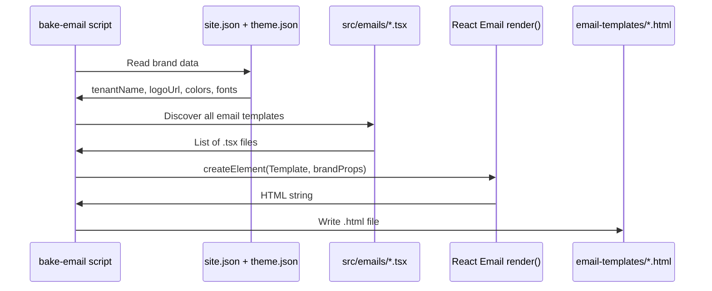

# Chapter 9: Email Baking Pipeline

In [Chapter 8: OlonJS Forms (Contact/Reservation Submission)](08_olonjs_forms__contact_reservation_submission_.md), we learned how a visitor's form submission travels from the browser to the OlonJS Cloud, which then sends a transactional email. But what does that email actually *look like*? How does it know to use the restaurant's brand colors and logo?

That's exactly what this chapter answers.

---

## What Problem Does This Solve?

Imagine your restaurant uses a bright forest-green brand color and a custom serif font. When a guest submits a reservation request, they receive a confirmation email. That email should *feel* like it came from your restaurant — same colors, same logo, same personality.

Without a smart system, you'd have two bad options:

1. **Hardcode the brand values** into the email template — but then every time the restaurant rebrands, someone has to manually hunt through email code and update it.
2. **Render the email at runtime** — meaning every time an email is sent, a server has to run React, load config files, and generate HTML on the fly. That's slow and wasteful.

**The Email Baking Pipeline solves both problems at once.** It's a build-time script that:
- Reads your brand data *once* from `site.json` and `theme.json`
- Renders your React email templates into static HTML files
- Saves those ready-to-send `.html` files into a folder called `email-templates/`

> 💡 **Analogy:** Think of it like a **printing press**. You design a beautiful menu card (the React template), load it with your restaurant's branding, press the button once, and out come hundreds of identical, perfectly branded cards — ready to hand to guests. You don't reprint a fresh card every time a guest sits down.

The "baking" happens *before* the restaurant opens (at build time), not while guests are waiting (at runtime).

---

## The Central Use Case

You want two transactional emails:

1. **Lead Notification** — sent to the restaurant owner when someone submits a form
2. **Sender Confirmation** — sent to the guest confirming their submission was received

Both emails should automatically use the restaurant's logo, name, colors, and fonts from `site.json` and `theme.json` — without any developer manually copying those values into the email code.

---

## The Big Picture First

Before any code, here's the mental model:

```
site.json + theme.json          (your brand data)
         +
LeadNotificationEmail.tsx       (your React email template)
         ↓
   bake-email.tsx script        (the printing press)
         ↓
email-templates/lead-notification.html  (ready-to-send HTML)
```

The script is the middle step. It combines brand data with email templates and produces static HTML files.

---

## Key Concept 1: React Email Templates

Your email templates live in `src/emails/` and are written as normal React components. They use a library called **React Email** which provides email-safe building blocks like `<Body>`, `<Container>`, `<Heading>`, `<Text>`, and so on.

Here's a tiny slice of `LeadNotificationEmail.tsx`:

```tsx
export function LeadNotificationEmail({ tenantName, logoUrl, theme }) {
  const primaryColor = theme?.colors?.primary || "#2D5016";

  return (
    <Html>
      <Body style={{ backgroundColor: "#FAFAF5" }}>
        <Container>
          
          <Heading>New lead from {tenantName}</Heading>
        </Container>
      </Body>
    </Html>
  );
}
```

Notice the props: `tenantName`, `logoUrl`, `theme`. These are the brand values that need to be *injected* at build time. The template itself doesn't know what restaurant it's for — it just uses whatever it receives.

> 💡 **Analogy:** The email template is like a **fill-in-the-blank form letter**. It has blank spaces for the restaurant name, logo, and colors. The baking script fills in those blanks.

---

## Key Concept 2: The `bake-email.tsx` Script

The script `scripts/bake-email.tsx` is the printing press. You run it from the command line, and it does three things:

1. **Reads** `site.json` and `theme.json` to gather brand data
2. **Imports** each email template from `src/emails/`
3. **Renders** each template to HTML and **saves** the result

Here's how to run it:

```bash
npx tsx scripts/bake-email.tsx
```

That's it. After running, you'll find files like this:

```
email-templates/
├── lead-notification.html
└── lead-sender-confirmation.html
```

These are complete, self-contained HTML files ready to be sent by any email service.

---

## Key Concept 3: Reading Brand Data

The script reads your two config files — `site.json` and `theme.json` — and extracts the values that matter for emails.

```ts
// scripts/bake-email.tsx (simplified)
const site = await readJsonObject("src/data/config/site.json");
const theme = await readJsonObject("src/data/config/theme.json");
```

From `site.json`, it extracts things like:

```ts
const tenantName = site?.identity?.title || "My Restaurant";
const logoUrl = site?.header?.data?.logoImageUrl?.url;
```

From `theme.json`, it extracts color and font tokens:

```ts
const themeProps = {
  colors: theme?.tokens?.colors,
  typography: theme?.tokens?.typography,
};
```

These values become the **default props** injected into every email template.

> 💡 **Analogy:** This is the script going to the restaurant's brand book (`site.json` and `theme.json`), writing down all the important details on a notepad, and then handing that notepad to the printing press.

---

## Key Concept 4: Building the Default Props

All the extracted brand values get assembled into one object called `defaultProps`:

```ts
// scripts/bake-email.tsx (simplified)
function buildDefaultProps(site, theme) {
  return {
    tenantName: site?.identity?.title || "{{tenantName}}",
    logoUrl: site?.header?.data?.logoImageUrl?.url,
    brandName: site?.footer?.data?.brandText,
    tagline: site?.footer?.data?.tagline,
    theme: {
      colors: theme?.tokens?.colors,
      typography: theme?.tokens?.typography,
    },
    // placeholder data for the preview
    correlationId: "preview-001",
    leadData: { name: "Preview User", email: "preview@example.com" },
  };
}
```

The `correlationId` and `leadData` are placeholder values used just for the preview render — in production, the Cloud would inject real values when sending an actual email.

---

## Key Concept 5: Rendering to HTML

Once the props are ready, the script uses React Email's `render()` function to turn the React component into an HTML string:

```ts
// scripts/bake-email.tsx (simplified)
import { render } from "@react-email/render";
import React from "react";

const html = await render(
  React.createElement(EmailComponent, defaultProps)
);
```

`React.createElement(EmailComponent, defaultProps)` is the same as writing `<EmailComponent {...defaultProps} />` in JSX. It creates a React element, and `render()` converts it to a complete HTML string — inline styles, tables, and all the email-safe markup that email clients need.

> 💡 **Analogy:** `render()` is the actual printing press mechanism. You feed it the template and the ink (props), and it produces a printed page (HTML string).

---

## Key Concept 6: Discovering Templates Automatically

The script doesn't require you to manually list your email templates. It automatically scans the `src/emails/` folder for any `.tsx` or `.jsx` files:

```ts
// scripts/bake-email.tsx (simplified)
async function discoverEmailEntries(rootDir) {
  const files = await fs.readdir(rootDir);
  return files.filter((name) => /\.(tsx|jsx)$/i.test(name));
}
```

Add a new file to `src/emails/` and it's automatically picked up on the next run. No registration needed.

The output filename is derived from the component filename:

```
LeadNotificationEmail.tsx  →  lead-notification.html
LeadSenderConfirmationEmail.tsx  →  lead-sender-confirmation.html
```

The script strips the `Email` suffix and converts `CamelCase` to `kebab-case`.

---

## How It All Works: Step by Step

Here's the complete journey when you run `npx tsx scripts/bake-email.tsx`:



1. The script reads `site.json` and `theme.json`
2. It scans `src/emails/` and finds all template files
3. For each template, it imports the React component
4. It calls `render()` with the component and brand props
5. It writes the resulting HTML to `email-templates/`

---

## Diving Into the Code

Let's trace through the key parts of `scripts/bake-email.tsx` step by step.

**Step 1: Read the config files.**

```ts
const siteConfigPath = args.siteConfig ?? DEFAULT_SITE_CONFIG;
const themeConfigPath = args.themeConfig ?? DEFAULT_THEME_CONFIG;

const site = await readJsonObject<SiteConfig>(siteConfigPath);
const theme = await readJsonObject<ThemeConfig>(themeConfigPath);
```

`readJsonObject` is a small helper that reads a JSON file and parses it. If the file doesn't exist, it returns `null` gracefully.

**Step 2: Build the default props.**

```ts
const defaultProps = buildDefaultProps(site, theme);
```

This assembles everything from `site.json` and `theme.json` into one object that every email template will receive.

**Step 3: Discover email templates.**

```ts
const entries = await discoverEmailEntries(emailDir);
// entries = ["src/emails/LeadNotificationEmail.tsx", ...]
```

The script finds every `.tsx` file in `src/emails/` and builds a list of absolute file paths.

**Step 4: Import and render each template.**

```ts
for (const target of bakeTargets) {
  const mod = await import(pathToFileURL(target.entryAbs).href);
  const Component = findExport(mod, args.exportName);
  const html = await render(React.createElement(Component, defaultProps));
  await fs.writeFile(target.outAbs, html, "utf8");
}
```

For each template:
- `import()` dynamically loads the module
- `findExport()` finds the React component inside it
- `render()` converts it to HTML
- `fs.writeFile()` saves the result

**Step 5: Done! ✅**

The output files are saved to `email-templates/` with kebab-case names.

---

## What the Output Looks Like

After running the script, `email-templates/lead-notification.html` contains a complete, self-contained HTML email — something like:

```html
<!DOCTYPE html>
<html>
  <head>...</head>
  <body style="background-color: #FAFAF5; font-family: Inter, Arial, sans-serif;">
    <table>
      <tr>
        <td>
          
          <h1 style="color: #1C1C14;">New lead from Radice</h1>
          <!-- ... field data ... -->
        </td>
      </tr>
    </table>
  </body>
</html>
```

All the brand values — the logo URL, the restaurant name, the colors — are baked right in. The OlonJS Cloud can send this file directly without any further processing.

---

## The Connection to Forms

You might be wondering: how does this connect to the forms we built in [Chapter 8: OlonJS Forms (Contact/Reservation Submission)](08_olonjs_forms__contact_reservation_submission_.md)?

Here's the relationship:

```
Visitor submits form
       ↓
OlonJS Cloud receives the data
       ↓
Cloud looks up the pre-baked email template
       ↓
Cloud fills in the real lead data (name, email, message)
       ↓
Cloud sends the email
```

The baking pipeline produces the *template shell* — the branded HTML frame. The Cloud fills in the *dynamic data* (the actual form submission) at send time. The two concerns are cleanly separated:

- **Brand design** → baked at build time (your job)
- **Form content** → injected at send time (the Cloud's job)

> 💡 **Analogy:** The baking pipeline prints the branded menu cards with the restaurant's logo and colors. The waiter fills in the daily specials by hand just before service. Both steps are necessary, but they happen at different times.

---

## Adding Your Own Email Template

Want to add a new email — say, a "Booking Confirmed" notification? Here's all you need to do:

**Step 1:** Create `src/emails/BookingConfirmedEmail.tsx`.

```tsx
import React from "react";
import { Html, Body, Heading, Text } from "@react-email/components";

export function BookingConfirmedEmail({ tenantName, logoUrl }) {
  return (
    <Html>
      <Body>
        <Heading>Your booking at {tenantName} is confirmed!</Heading>
        <Text>We look forward to seeing you.</Text>
      </Body>
    </Html>
  );
}
```

**Step 2:** Run the baking script.

```bash
npx tsx scripts/bake-email.tsx
```

**Step 3:** Find your new file at `email-templates/booking-confirmed.html`. ✅

No registration needed. The script discovers it automatically.

---

## Quick Reference

| What | Where |
|---|---|
| Email templates (source) | `src/emails/*.tsx` |
| Baked output (HTML files) | `email-templates/*.html` |
| The baking script | `scripts/bake-email.tsx` |
| Brand data source | `src/data/config/site.json` |
| Theme data source | `src/data/config/theme.json` |
| How to run | `npx tsx scripts/bake-email.tsx` |

---

## Summary

Here's what you learned in this chapter:

- The **Email Baking Pipeline** is a build-time script that pre-renders React email templates into static HTML files
- It reads brand data from [Page & Site Config JSON](02_page___site_config_json_.md) (`site.json` and `theme.json`) and injects it as default props into each template
- Email templates live in `src/emails/` and are written as React components using the **React Email** library
- The `render()` function from React Email converts a React component into an email-safe HTML string
- Templates are **discovered automatically** — just add a `.tsx` file to `src/emails/` and it's picked up on the next run
- The output files in `email-templates/` are ready-to-send HTML — the OlonJS Cloud uses them as branded shells and fills in dynamic form data at send time
- This approach means **zero runtime rendering overhead** and **automatic brand consistency** across all transactional emails

The baking pipeline is your printing press — run it once at build time, and your perfectly branded emails are ready to go, no matter how many

---

Generated by [AI Codebase Knowledge Builder](https://github.com/The-Pocket/Tutorial-Codebase-Knowledge)