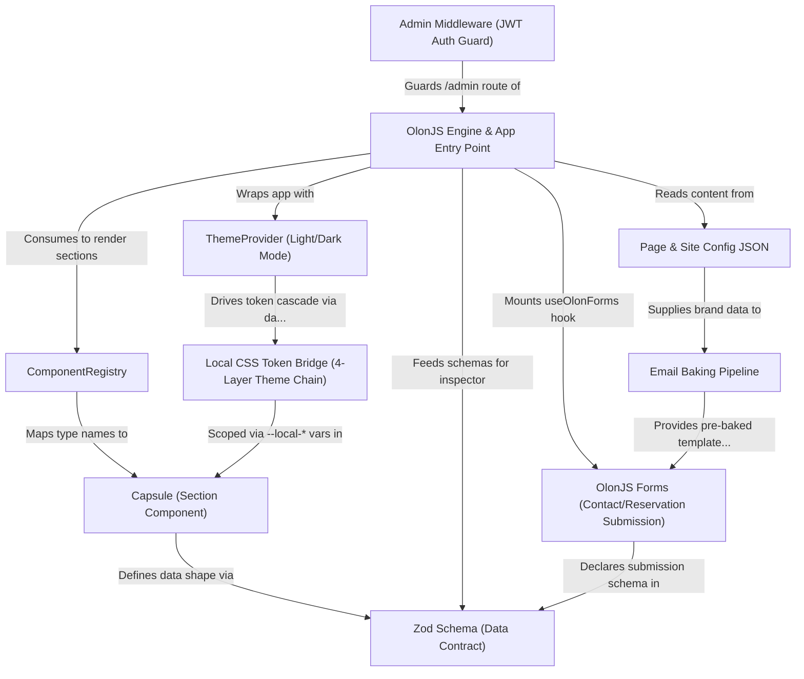

# Tutorial: RadiceV2

**RadiceV2** is a production-ready website template for high-end restaurants, built on the **OlonJS** framework.
Think of it as a fully assembled restaurant website where every visual section (called a *Capsule*) is both
beautifully designed and *visually editable* through a built-in CMS inspector — no code changes needed for
content updates. The site is **contract-first**: every piece of content is validated by a strict *Zod schema*,
making it type-safe for developers and AI-friendly for automation. It supports light/dark mode, contact forms
that send emails automatically, JWT-protected admin access, and one-click deployment to Vercel.

**Source Repository:** [https://github.com/olonjs/RadiceV2](https://github.com/olonjs/RadiceV2)

## Chapters

1. [OlonJS Engine & App Entry Point
](01_olonjs_engine___app_entry_point_.md)
2. [Page & Site Config JSON
](02_page___site_config_json_.md)
3. [Capsule (Section Component)
](03_capsule__section_component__.md)
4. [ComponentRegistry
](04_componentregistry_.md)
5. [Zod Schema (Data Contract)
](05_zod_schema__data_contract__.md)
6. [ThemeProvider (Light/Dark Mode)
](06_themeprovider__light_dark_mode__.md)
7. [Local CSS Token Bridge (4-Layer Theme Chain)
](07_local_css_token_bridge__4_layer_theme_chain__.md)
8. [OlonJS Forms (Contact/Reservation Submission)
](08_olonjs_forms__contact_reservation_submission__.md)
9. [Email Baking Pipeline
](09_email_baking_pipeline_.md)
10. [Admin Middleware (JWT Auth Guard)
](10_admin_middleware__jwt_auth_guard__.md)

---

Generated by [AI Codebase Knowledge Builder](https://github.com/The-Pocket/Tutorial-Codebase-Knowledge)